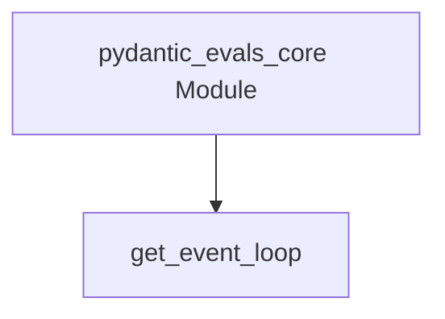

# utility_functions Module Documentation

## Introduction

The `utility_functions` module, a core component of the `pydantic_evals_core`, provides essential helper functions primarily focused on managing asynchronous operations. Its main purpose is to ensure that an `asyncio` event loop is readily available for other components within the evaluation framework, facilitating robust and stable execution of asynchronous tasks.

## Architecture and Component Relationships

The `utility_functions` module is a leaf module within the `pydantic_evals_core`, encapsulating a single, critical function for asynchronous programming.

### Core Components

*   **`get_event_loop`**: This function is responsible for retrieving the current `asyncio` event loop. If no event loop is currently set in the running thread, it creates a new one and sets it as the default. This mechanism prevents `RuntimeError` exceptions that can occur when asynchronous code attempts to run without an active event loop, ensuring that all asynchronous operations have a valid execution context.

<!-- DIAGRAM_JSON
{
    "direction": "TD",
    "nodes": [
        {"id": "get_event_loop", "label": "get_event_loop", "type": "component", "link": null},
        {"id": "pydantic_evals_core", "label": "pydantic_evals_core Module", "type": "external", "link": "pydantic_evals_core.md"}
    ],
    "edges": [
        {"source": "pydantic_evals_core", "target": "get_event_loop"}
    ],
    "groups": []
}
-->

## How the Module Fits into the Overall System

The `utility_functions` module serves as a foundational asynchronous helper for the entire [pydantic_evals_core](pydantic_evals_core.md) framework. Its `get_event_loop` function is crucial for ensuring that any part of the evaluation system, particularly those dealing with online evaluations, dataset generation, or other I/O-bound operations, can reliably execute asynchronous code. By guaranteeing an active event loop, it underpins the stability and functionality of all concurrent and asynchronous tasks within `pydantic_evals`, making it an indispensable utility for the framework's operational integrity.