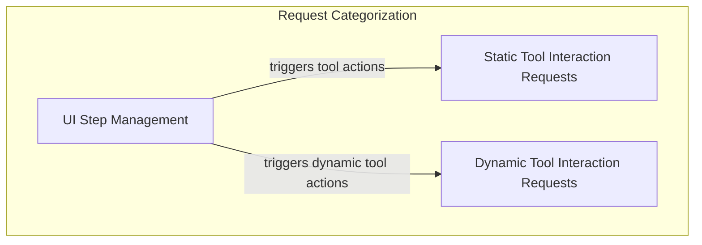

# vercel_ai_request_types Module Documentation

## Introduction and Purpose

The `vercel_ai_request_types` module defines the standardized data structures for representing various user interface interactions and tool call states as incoming requests within the Vercel AI SDK integration. These types facilitate communication between the frontend UI and the AI backend, enabling dynamic UI updates, tool execution control, and user approval workflows.

This module is a crucial part of the [ui_vercel_ai_adapter](ui_vercel_ai_adapter.md) responsible for translating UI events and tool states into a structured format for the AI agent to process.

## Architecture Overview

The `vercel_ai_request_types` module is organized into several key areas, primarily distinguishing between the management of UI steps and different types of tool interactions.

<!-- DIAGRAM_JSON
{
    "direction": "TD",
    "nodes": [
        {"id": "ui_step_management", "label": "UI Step Management", "type": "module", "link": "ui_step_management.md"},
        {"id": "static_tool_requests", "label": "Static Tool Interaction Requests", "type": "module", "link": "static_tool_requests.md"},
        {"id": "dynamic_tool_requests", "label": "Dynamic Tool Interaction Requests", "type": "module", "link": "dynamic_tool_requests.md"}
    ],
    "edges": [
        {"source": "ui_step_management", "target": "static_tool_requests", "label": "triggers tool actions"},
        {"source": "ui_step_management", "target": "dynamic_tool_requests", "label": "triggers dynamic tool actions"}
    ],
    "groups": [
        {
            "id": "request_categorization",
            "label": "Request Categorization",
            "role": "analytical",
            "nodes": ["ui_step_management", "static_tool_requests", "dynamic_tool_requests"]
        }
    ]
}
-->

## High-Level Functionality

This module categorizes incoming Vercel AI SDK requests into different types, each corresponding to a specific state or action within the UI.

### UI Step Management

The [ui_step_management](ui_step_management.md) sub-module defines the `StepStartUIPart` which indicates the beginning of a new logical step in the AI agent's execution or interaction flow. This helps the UI to render appropriate boundaries or states for each distinct phase of operation.

### Static Tool Interaction Requests

The [static_tool_requests](static_tool_requests.md) sub-module encapsulates request types for interacting with predefined or 'static' tools. This includes states where tool input is being streamed, user approval for tool execution is requested, and when that approval has been responded to. These types enable fine-grained control and feedback for tool execution in the UI.

### Dynamic Tool Interaction Requests

The [dynamic_tool_requests](dynamic_tool_requests.md) sub-module provides request types for more complex interactions involving 'dynamic' tools, which may have variable inputs and outputs. It covers a broader range of states such as input streaming, input/output availability, user approval requests and responses, and even scenarios where tool output is denied. This allows for flexible and interactive tool execution workflows within the UI.