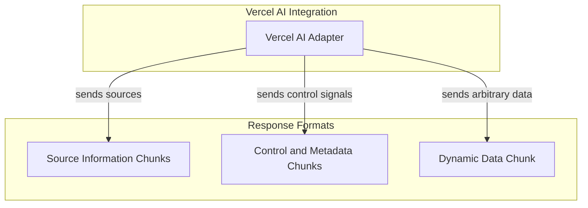

# Vercel AI Response Types

## Introduction and Purpose

The `vercel_ai_response_types` module defines the standardized data structures for various response chunks transmitted from the backend AI agent to the Vercel AI frontend. This module is critical for enabling rich, interactive user experiences within the Vercel AI platform by providing clear contracts for different types of information, such as source references, dynamic data payloads, and control signals. It ensures consistent communication, allowing the UI to correctly interpret and display the agent's output.

## Architecture Overview

This module is a core component of the Vercel AI UI integration, residing within the `ui_vercel_ai_adapter` module. It primarily provides the serialization schemas that the [vercel_ai_integration_adapter.md](vercel_ai_integration_adapter.md) uses to format responses for the Vercel AI frontend. These response types are consumed by the Vercel AI frontend to render information, manage UI state, and provide interactive elements. The types are designed to be extensible, supporting various use cases from displaying retrieved sources to signaling process interruptions.

<!-- DIAGRAM_JSON
{
    "direction": "TD",
    "nodes": [
        {
            "id": "vercel_ai_response_types",
            "label": "Vercel AI Response Definitions",
            "type": "module"
        },
        {
            "id": "vercel_ai_integration_adapter",
            "label": "Vercel AI Adapter",
            "type": "module",
            "link": "vercel_ai_integration_adapter.md"
        },
        {
            "id": "source_chunks",
            "label": "Source Information Chunks",
            "type": "module",
            "link": "source_chunks.md"
        },
        {
            "id": "control_chunks",
            "label": "Control and Metadata Chunks",
            "type": "module",
            "link": "control_chunks.md"
        },
        {
            "id": "dynamic_data_chunk",
            "label": "Dynamic Data Chunk",
            "type": "module",
            "link": "dynamic_data_chunk.md"
        }
    ],
    "edges": [
        {
            "source": "vercel_ai_integration_adapter",
            "target": "source_chunks",
            "label": "sends sources"
        },
        {
            "source": "vercel_ai_integration_adapter",
            "target": "control_chunks",
            "label": "sends control signals"
        },
        {
            "source": "vercel_ai_integration_adapter",
            "target": "dynamic_data_chunk",
            "label": "sends arbitrary data"
        }
    ],
    "groups": [
        {
            "id": "integration",
            "label": "Vercel AI Integration",
            "role": "surface",
            "nodes": [
                "vercel_ai_integration_adapter"
            ]
        },
        {
            "id": "response_formats",
            "label": "Response Formats",
            "role": "data",
            "nodes": [
                "source_chunks",
                "control_chunks",
                "dynamic_data_chunk"
            ]
        }
    ]
}
-->

## Sub-modules

The `vercel_ai_response_types` module is organized into the following sub-modules, each handling a specific category of response data:

*   **[Source Information Chunks](source_chunks.md)**: Defines chunks for transmitting source URLs and document details.
*   **[Control and Metadata Chunks](control_chunks.md)**: Manages chunks for signaling abortion or conveying message-specific metadata.
*   **[Dynamic Data Chunk](dynamic_data_chunk.md)**: Provides a flexible chunk for sending arbitrary, dynamically typed data payloads.
