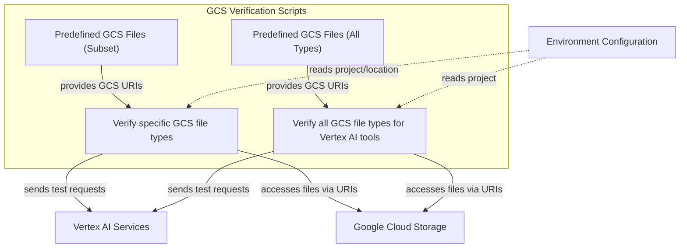

# Vertex GCS Verification Module

## Introduction

The `vertex_gcs_verification` module provides essential utility scripts for verifying the interaction of Vertex AI services with Google Cloud Storage (GCS) resources. Specifically, it tests how Vertex AI processes various file types stored as `gs://` URIs, ensuring robust data handling and correct tool functionality within the Google Cloud ecosystem. This module is critical for maintaining the reliability of AI agents and applications that depend on data stored in GCS and processed by Vertex AI.

## Module Architecture and Functionality

This module contains two primary verification scripts, each designed to test different aspects of Vertex AI's GCS integration:

*   `scripts.verify_vertex_gcs.main`: This script focuses on verifying Vertex AI's capabilities with a predefined subset of GCS file types. It initializes the environment by printing the configured Google Project and Location, then iterates through a list of GCS URIs and their corresponding MIME types. For each entry, it invokes a testing function (`test_vertex_with_gcs_uri`) to perform the verification against Vertex AI services.

*   `scripts.verify_vertex_gcs_all_types.main`: Expanding on the previous script, this component verifies Vertex AI tool results across a broader range of GCS file types. It similarly sets up the environment and iterates through an extensive list of `gs://` URIs. It then calls a general testing function (`test_file_type`) to ensure comprehensive compatibility and correct processing by Vertex AI tools.

Both scripts are crucial for validating that data pipeline components correctly access and interpret various data formats from GCS when consumed by Vertex AI, thereby preventing integration issues and ensuring data integrity.

<!-- DIAGRAM_JSON
{
    "direction": "TD",
    "nodes": [
        {
            "id": "verify_gcs_main",
            "label": "Verify specific GCS file types",
            "type": "component",
            "link": null
        },
        {
            "id": "verify_all_types_main",
            "label": "Verify all GCS file types for Vertex AI tools",
            "type": "component",
            "link": null
        },
        {
            "id": "gcs_files_list",
            "label": "Predefined GCS Files (Subset)",
            "type": "component",
            "link": null
        },
        {
            "id": "all_files_list",
            "label": "Predefined GCS Files (All Types)",
            "type": "component",
            "link": null
        },
        {
            "id": "vertex_ai_services",
            "label": "Vertex AI Services",
            "type": "external",
            "link": "model_provider_gemini.md"
        },
        {
            "id": "gcs_storage",
            "label": "Google Cloud Storage",
            "type": "external",
            "link": null
        },
        {
            "id": "environment_config",
            "label": "Environment Configuration",
            "type": "external",
            "link": null
        }
    ],
    "edges": [
        {
            "source": "environment_config",
            "target": "verify_gcs_main",
            "label": "reads project/location"
        },
        {
            "source": "environment_config",
            "target": "verify_all_types_main",
            "label": "reads project"
        },
        {
            "source": "gcs_files_list",
            "target": "verify_gcs_main",
            "label": "provides GCS URIs"
        },
        {
            "source": "all_files_list",
            "target": "verify_all_types_main",
            "label": "provides GCS URIs"
        },
        {
            "source": "verify_gcs_main",
            "target": "vertex_ai_services",
            "label": "sends test requests"
        },
        {
            "source": "verify_gcs_main",
            "target": "gcs_storage",
            "label": "accesses files via URIs"
        },
        {
            "source": "verify_all_types_main",
            "target": "vertex_ai_services",
            "label": "sends test requests"
        },
        {
            "source": "verify_all_types_main",
            "target": "gcs_storage",
            "label": "accesses files via URIs"
        }
    ],
    "groups": [
        {
            "id": "verification_scripts",
            "label": "GCS Verification Scripts",
            "role": "functional",
            "nodes": [
                "verify_gcs_main",
                "verify_all_types_main",
                "gcs_files_list",
                "all_files_list"
            ]
        }
    ]
}
-->

## How it Connects to the Rest of the System

The `vertex_gcs_verification` module plays a crucial role in the `project_documentation_and_developer_tools` section, specifically under `developer_utility_scripts.testing_and_verification`. As a testing module, it ensures the reliability of components that integrate with Google Cloud services.

Its key external connections include:

*   **Vertex AI Services**: The primary interaction is with various Vertex AI services. These scripts send test requests to Vertex AI, verifying its ability to process data referenced by `gs://` URIs. This indirectly validates the functionality of model providers and related components, such as those within the [model_provider_gemini](model_provider_gemini.md) module, when deployed on Vertex AI.
*   **Google Cloud Storage (GCS)**: The module directly interacts with GCS to retrieve test data. It relies on the `gs://` URI scheme to access files, confirming that Vertex AI can correctly fetch and interpret these resources.
*   **Environment Configuration**: The scripts depend on environment variables, such as `GOOGLE_PROJECT` and `GOOGLE_LOCATION`, to determine the target Google Cloud project and region for verification. This ensures that tests are executed in the correct cloud environment.

By systematically testing these interactions, the `vertex_gcs_verification` module contributes to the overall stability and correctness of the AI agent's capabilities when operating within the Google Cloud environment.