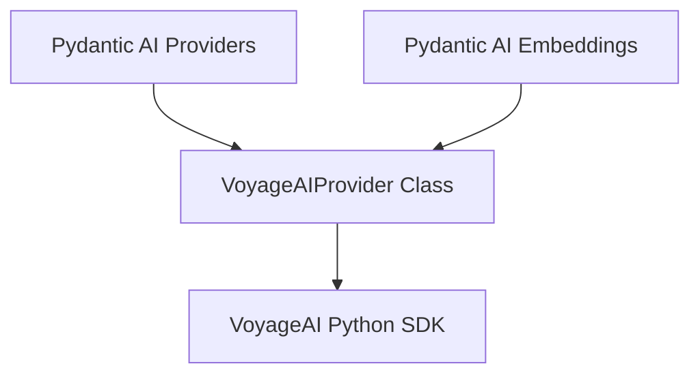

# voyageai_provider

The `voyageai_provider` module provides a robust interface for interacting with the VoyageAI API, specifically designed to support embedding functionalities within the system. It encapsulates the VoyageAI `AsyncClient` and manages the necessary authentication details.

## Core Functionality

The primary component of this module is the `VoyageAIProvider` class, which facilitates seamless integration with the VoyageAI API.

### `VoyageAIProvider` Class

The `VoyageAIProvider` class offers the following key functionalities:

-   **`name` property**: Returns the string identifier 'voyageai'.
-   **`base_url` property**: Provides the base URL for the VoyageAI API, defaulting to `https://api.voyageai.com/v1`.
-   **`client` property**: Returns the initialized `AsyncClient` instance for direct interaction with the VoyageAI API.
-   **Initialization (`__init__`)**:
    -   Allows initialization using either an existing `voyageai_client` instance or an `api_key` string.
    -   If an `api_key` is provided, it can be explicitly passed during instantiation or automatically retrieved from the `VOYAGE_API_KEY` environment variable.
    -   Ensures that only one of `voyageai_client` or `api_key` is provided to prevent configuration conflicts.
    -   Raises a `UserError` if no API key is found through either explicit passing or environment variables, ensuring secure and authenticated access to the VoyageAI service.

## Architecture and Component Relationships

The `voyageai_provider` module is a leaf module within the broader `pydantic_ai_providers` structure. It directly utilizes the VoyageAI Python SDK for its operations. The provider is also consumed by the `pydantic_ai_embeddings` module to leverage VoyageAI's embedding capabilities.

<!-- DIAGRAM_JSON
{
    "direction": "TD",
    "nodes": [
        {"id": "voyageai_provider_class", "label": "VoyageAIProvider Class", "type": "component", "link": null},
        {"id": "voyageai_sdk", "label": "VoyageAI Python SDK", "type": "external", "link": null},
        {"id": "pydantic_ai_providers", "label": "Pydantic AI Providers", "type": "external", "link": "pydantic_ai_providers.md"},
        {"id": "pydantic_ai_embeddings", "label": "Pydantic AI Embeddings", "type": "external", "link": "pydantic_ai_embeddings.md"}
    ],
    "edges": [
        {"source": "voyageai_provider_class", "target": "voyageai_sdk"},
        {"source": "pydantic_ai_providers", "target": "voyageai_provider_class"},
        {"source": "pydantic_ai_embeddings", "target": "voyageai_provider_class"}
    ],
    "groups": []
}
-->

## How the Module Fits into the Overall System

The `voyageai_provider` module serves as a specific implementation of a language model provider, adhering to the common interface defined within the [pydantic_ai_providers](pydantic_ai_providers.md) module. Its primary role is to enable the system to interact with VoyageAI's services for embedding tasks.

Specifically, the [pydantic_ai_embeddings](pydantic_ai_embeddings.md) module utilizes this provider to access VoyageAI's embedding models, allowing for the generation of high-quality vector representations of text. By abstracting the complexities of API interaction and authentication, `voyageai_provider` ensures that other parts of the system can seamlessly integrate VoyageAI's capabilities without needing to manage low-level details. This modular design promotes maintainability and allows for easy swapping or addition of other embedding providers in the future.