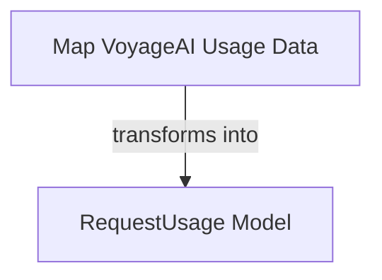

# VoyageAI Usage Mapping Module

## Introduction

The `voyageai_usage_mapping` module is a specialized component within the `pydantic_ai_slim` framework responsible for standardizing the reporting of usage metrics from VoyageAI embedding models. Its primary function is to translate raw token counts provided by VoyageAI into a universal `RequestUsage` format, ensuring consistent consumption tracking across various embedding providers.

This module is crucial for accurate cost analysis, monitoring, and unified reporting within AI applications that leverage VoyageAI embeddings, allowing developers to integrate VoyageAI models seamlessly into a system that expects a standardized usage data structure.

## Module Architecture

The `voyageai_usage_mapping` module contains a single, focused utility function that performs the essential translation task.

<!-- DIAGRAM_JSON
{
    "direction": "TD",
    "nodes": [
        {"id": "map_usage_func", "label": "Map VoyageAI Usage Data", "type": "component", "link": null},
        {"id": "request_usage_model", "label": "RequestUsage Model", "type": "external", "link": "agent_utilities.md"}
    ],
    "edges": [
        {"source": "map_usage_func", "target": "request_usage_model", "label": "transforms into"}
    ],
    "groups": []
}
-->



### Core Components

#### `_map_usage` function

- **Component ID**: `pydantic_ai_slim.pydantic_ai.embeddings.voyageai._map_usage`
- **Description**: This function is the sole component of this module. It takes an integer representing the total tokens consumed by a VoyageAI embedding request and returns a `RequestUsage` object. Specifically, it populates the `input_tokens` field of the `RequestUsage` object with the provided `total_tokens`.
- **Purpose**: To provide a standardized interface for reporting VoyageAI embedding usage, aligning it with the common `RequestUsage` schema used across the `pydantic_ai_slim` system.

```python
def _map_usage(total_tokens: int) -> RequestUsage:
    return RequestUsage(input_tokens=total_tokens)
```

### How it Connects

This module acts as a vital translation layer within the broader [embedding provider integrations](embedding_provider_integrations.md) system. It receives raw usage data directly from the VoyageAI API integration and converts it into a format that can be understood and processed by the core [agent utilities](agent_utilities.md) module, specifically the `RequestUsage` data model. This ensures that regardless of the underlying embedding provider, usage metrics are reported consistently throughout the application, facilitating unified logging, billing, and performance analysis. This module's output is directly consumed by higher-level components responsible for overall application usage tracking.