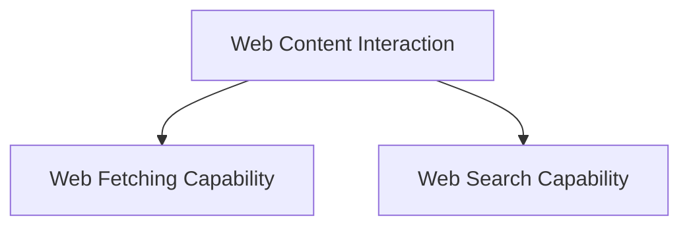

# Web Content Interaction Module

The `web_content_interaction` module provides robust capabilities for interacting with web content, encompassing both fetching specific URLs and performing comprehensive web searches. It offers a flexible approach by supporting both built-in model functionalities and local tool fallbacks, ensuring reliable operation across different environments. This module is a key part of the `tool_integrations` module, enabling agents to gather information directly from the web.

## Architecture Overview

<!-- DIAGRAM_JSON
{
    "direction": "TD",
    "nodes": [
        {"id": "web_fetch_capability", "label": "Web Fetching Capability", "type": "module", "link": "web_fetch_capability.md"},
        {"id": "web_search_capability", "label": "Web Search Capability", "type": "module", "link": "web_search_capability.md"}
    ],
    "edges": [
        {"source": "web_content_interaction", "target": "web_fetch_capability"},
        {"source": "web_content_interaction", "target": "web_search_capability"}
    ],
    "groups": []
}
-->

## Sub-modules and Functionality

### Web Fetching Capability

The `web_fetch_capability` sub-module, documented in [web_fetch_capability.md](web_fetch_capability.md), handles the fetching of content from specified URLs. It supports a flexible approach, attempting to use the model's built-in URL fetching capabilities first, and falling back to a local function tool if the built-in option is unavailable. This sub-module allows for configuration of allowed and blocked domains, maximum uses per run, and options for citations and content token limits.

### Web Search Capability

The `web_search_capability` sub-module, detailed in [web_search_capability.md](web_search_capability.md), provides functionality for performing web searches. Similar to web fetching, it prioritizes the model's built-in web search features but can fall back to a local search tool (e.g., DuckDuckGo). It offers configurations for controlling the search context size, specifying user location for localized results, and filtering results by allowed or blocked domains, as well as limiting the maximum number of searches per run.