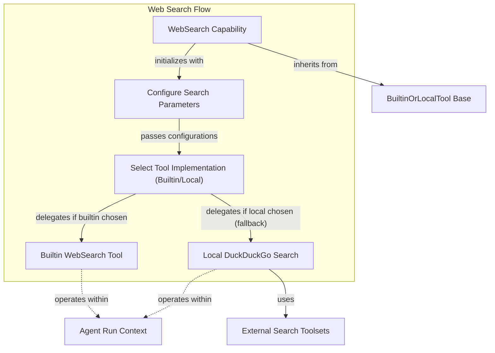

# Web Searching Module

The `web_searching` module provides the core functionality for agents to perform web searches. It intelligently leverages either a model's native (builtin) web search capabilities or falls back to a locally configured search tool, such as DuckDuckGo, ensuring robust information retrieval for the agent.

This module is crucial for agents that need to gather real-time information, query external knowledge bases, or perform research as part of their operational flow. It abstracts the complexities of interacting with different search mechanisms, presenting a unified interface for web-based data acquisition.

## WebSearch Capability

The `WebSearch` class is the primary component of this module. It acts as a versatile web search capability that can be integrated into an agent. It prioritizes using the language model's built-in web search tool if available, offering advanced features like search context sizing, user location targeting, and domain filtering. When a built-in tool is not available or preferred, it seamlessly falls back to a local function tool, providing a consistent search experience.

### Configuration Parameters

The `WebSearch` capability is highly configurable, allowing developers to fine-tune search behavior:

*   **`builtin`**: Specifies the built-in `WebSearchTool` to use. Can be `True` (to use the default built-in tool), a custom `WebSearchTool` instance, or a callable that returns a `WebSearchTool`. Set to `False` to disable built-in search.
*   **`local`**: Defines the local fallback tool. By default, this is the `duckduckgo_search_tool`. It can be set to `None` or `False` to disable local fallback, or a custom `Tool` instance or callable.
*   **`search_context_size`**: (`'low'`, `'medium'`, `'high'`) Controls the amount of context retrieved from the web for built-in tools. Ignored by local tools.
*   **`user_location`**: A `WebSearchUserLocation` object to localize search results for built-in tools. Ignored by local tools.
*   **`blocked_domains`**: A list of domains to exclude from search results. Requires built-in tool support.
*   **`allowed_domains`**: A list of domains to exclusively include in search results. Requires built-in tool support.
*   **`max_uses`**: The maximum number of web searches allowed per agent run. Requires built-in tool support.

### Behavior: Built-in vs. Local Fallback

When an agent utilizes the `WebSearch` capability, it follows a specific logic to determine which search mechanism to use:

1.  **Preference for Built-in**: If the underlying language model provides a native web search tool, `WebSearch` will attempt to use it, especially if configuration parameters like `blocked_domains`, `allowed_domains`, or `max_uses` are specified (as these typically require built-in support).
2.  **Local Fallback**: If no built-in tool is available or explicitly configured (e.g., `builtin=False`), `WebSearch` transparently falls back to a local search tool. By default, this is the [DuckDuckGo search tool](external_toolset_integrations.md), which provides a reliable alternative for web queries.
    *   **Dependency Note**: The DuckDuckGo fallback requires the `duckduckgo` optional group to be installed (e.g., `pip install "pydantic-ai-slim[duckduckgo]"`). A warning is issued if it's not installed.

## Architecture Diagram

<!-- DIAGRAM_JSON
{
    "direction": "TD",
    "nodes": [
        {
            "id": "web_search_capability",
            "label": "WebSearch Capability",
            "type": "component",
            "link": null
        },
        {
            "id": "configure_search",
            "label": "Configure Search Parameters",
            "type": "component",
            "link": null
        },
        {
            "id": "select_tool_impl",
            "label": "Select Tool Implementation (Builtin/Local)",
            "type": "component",
            "link": null
        },
        {
            "id": "builtin_web_search_tool",
            "label": "Builtin WebSearch Tool",
            "type": "component",
            "link": null
        },
        {
            "id": "local_duckduckgo_tool",
            "label": "Local DuckDuckGo Search",
            "type": "component",
            "link": null
        },
        {
            "id": "builtin_or_local_tool",
            "label": "BuiltinOrLocalTool Base",
            "type": "external",
            "link": "capabilities_tool_integration.md"
        },
        {
            "id": "external_search_toolsets",
            "label": "External Search Toolsets",
            "type": "external",
            "link": "external_toolset_integrations.md"
        },
        {
            "id": "agent_run_context",
            "label": "Agent Run Context",
            "type": "external",
            "link": "agent_execution_graph.md"
        }
    ],
    "edges": [
        {
            "source": "web_search_capability",
            "target": "configure_search",
            "label": "initializes with"
        },
        {
            "source": "configure_search",
            "target": "select_tool_impl",
            "label": "passes configurations"
        },
        {
            "source": "select_tool_impl",
            "target": "builtin_web_search_tool",
            "label": "delegates if builtin chosen"
        },
        {
            "source": "select_tool_impl",
            "target": "local_duckduckgo_tool",
            "label": "delegates if local chosen (fallback)"
        },
        {
            "source": "web_search_capability",
            "target": "builtin_or_local_tool",
            "label": "inherits from",
            "arrowhead": "open"
        },
        {
            "source": "builtin_web_search_tool",
            "target": "agent_run_context",
            "label": "operates within",
            "lineType": "dotted"
        },
        {
            "source": "local_duckduckgo_tool",
            "target": "external_search_toolsets",
            "label": "uses",
            "arrowhead": "normal"
        },
        {
            "source": "local_duckduckgo_tool",
            "target": "agent_run_context",
            "label": "operates within",
            "lineType": "dotted"
        }
    ],
    "groups": [
        {
            "id": "web_search_process",
            "label": "Web Search Flow",
            "role": "core",
            "nodes": [
                "web_search_capability",
                "configure_search",
                "select_tool_impl",
                "builtin_web_search_tool",
                "local_duckduckgo_tool"
            ]
        }
    ]
}
-->

## Integration with Other Modules

The `web_searching` module, primarily through its `WebSearch` capability, integrates with several other parts of the system:

*   **[Capabilities Tool Integration](capabilities_tool_integration.md)**: `WebSearch` inherits from `BuiltinOrLocalTool`, enabling it to seamlessly switch between different tool implementations based on availability and configuration.
*   **[External Toolset Integrations](external_toolset_integrations.md)**: When a local search fallback is used, `WebSearch` leverages tools defined in the `external_toolset_integrations` module, such as the `duckduckgo_search_tool`.
*   **[Agent Execution Graph](agent_execution_graph.md)**: The search operations performed by `WebSearch` occur within the context of an agent's run, interacting with the `RunContext` managed by the agent execution graph to access necessary information and propagate results.