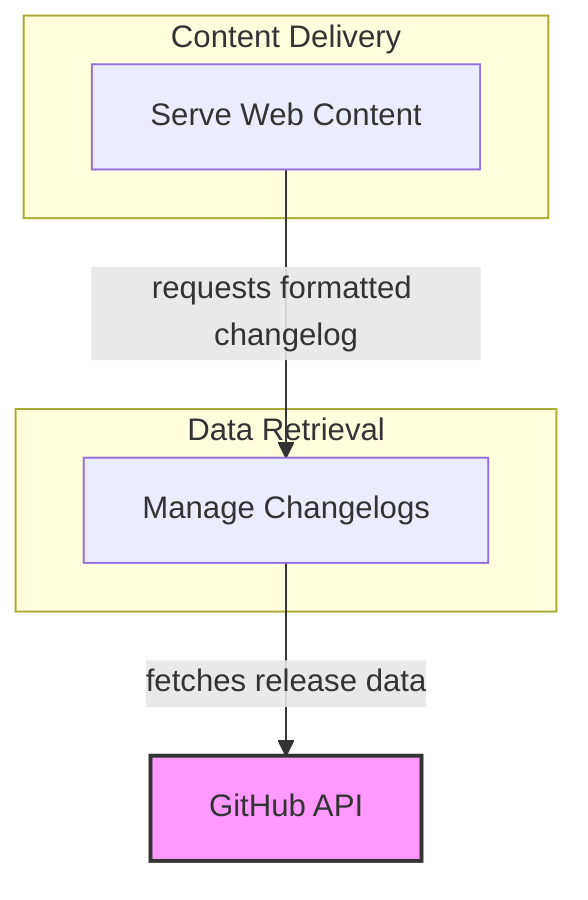

# Website Content Delivery Module

The `website_content_delivery` module is responsible for serving various types of content, including static files and dynamic data like changelogs, to the documentation website. It ensures that content is delivered efficiently and in the correct format to users.

## Architecture Overview

This module integrates with external services like GitHub for dynamic content retrieval and utilizes internal caching mechanisms to optimize performance. It provides clear separation between content serving logic and content preparation.

<!-- DIAGRAM_JSON
{
    "direction": "TD",
    "nodes": [
        {
            "id": "website_content_delivery",
            "label": "Website Content Delivery",
            "type": "module"
        },
        {
            "id": "content_serving",
            "label": "Serve Web Content",
            "type": "module",
            "link": "content_serving.md"
        },
        {
            "id": "changelog_management",
            "label": "Manage Changelogs",
            "type": "module",
            "link": "changelog_management.md"
        },
        {
            "id": "github_api",
            "label": "GitHub API",
            "type": "external",
            "link": "https://docs.github.com/en/rest/overview/endpoints-available-for-github-apps"
        }
    ],
    "edges": [
        {
            "source": "content_serving",
            "target": "changelog_management",
            "label": "requests formatted changelog"
        },
        {
            "source": "changelog_management",
            "target": "github_api",
            "label": "fetches release data"
        }
    ],
    "groups": [
        {
            "id": "content_delivery",
            "label": "Content Delivery",
            "role": "surface",
            "nodes": [
                "content_serving"
            ]
        },
        {
            "id": "data_retrieval",
            "label": "Data Retrieval",
            "role": "generative",
            "nodes": [
                "changelog_management"
            ]
        }
    ]
}
-->

## Sub-modules

- ### [Content Serving](content_serving.md)
  Handles the efficient delivery of static and Markdown content as text responses.

- ### [Changelog Management](changelog_management.md)
  Manages the fetching, caching, and formatting of release and changelog information from GitHub.
