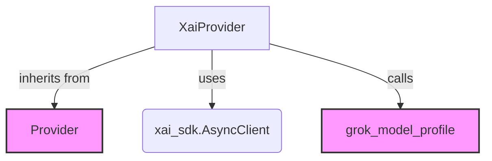

# xai_provider Module Documentation

The `xai_provider` module provides the necessary interface to interact with the xAI API, specifically focusing on handling authentication and client initialization for accessing xAI services. It acts as a wrapper around the native xAI SDK, simplifying its integration within the larger system.

## Purpose and Core Functionality

This module's primary purpose is to encapsulate the logic for connecting to the xAI platform. It offers a `XaiProvider` class that facilitates the creation and management of an xAI client, either through an API key or by accepting an already initialized `xai_sdk.AsyncClient` instance. This design ensures flexible integration while maintaining a consistent provider interface across different AI services.

Key functionalities include:
*   **xAI Client Initialization**: Manages the instantiation of the `xai_sdk.AsyncClient`, supporting both direct client injection and API key-based authentication (using `XAI_API_KEY` environment variable or explicit argument).
*   **Model Profile Retrieval**: Provides a static method to retrieve model-specific profiles, leveraging existing model profile definitions (e.g., `grok_model_profile`) to configure models appropriately for the xAI ecosystem.
*   **Provider Abstraction**: Implements the `Provider` abstract class, ensuring compatibility with the broader provider architecture of the system.

## Architecture and Component Relationships

The `xai_provider` module consists primarily of the `XaiProvider` class, which is responsible for managing the connection to the xAI API.

<!-- DIAGRAM_JSON
{
    "direction": "TD",
    "nodes": [
        {"id": "xai_provider_class", "label": "XaiProvider", "type": "component", "link": null},
        {"id": "async_client", "label": "xai_sdk.AsyncClient", "type": "external", "link": null},
        {"id": "base_provider", "label": "Provider", "type": "external", "link": "pydantic_ai_providers.md"},
        {"id": "grok_model_profile_func", "label": "grok_model_profile", "type": "external", "link": "pydantic_ai_providers.md"}
    ],
    "edges": [
        {"source": "xai_provider_class", "target": "base_provider"},
        {"source": "xai_provider_class", "target": "async_client"},
        {"source": "xai_provider_class", "target": "grok_model_profile_func"}
    ],
    "groups": []
}
-->

### Components

*   **`XaiProvider`**: This is the core class within the module. It handles the instantiation of the `xai_sdk.AsyncClient` and provides properties for the provider's name and base URL. It also includes a static method `model_profile` to retrieve model-specific configurations.

## How the Module Fits into the Overall System

The `xai_provider` module is a crucial part of the larger `pydantic_ai_providers` ecosystem, which aims to provide a unified interface for interacting with various AI model providers. By implementing the `Provider` abstract class, `XaiProvider` seamlessly integrates into the system, allowing other modules (e.g., those responsible for agent execution or model invocation) to use xAI models interchangeably with models from other providers.

This module contributes to the system's extensibility by abstracting away the specifics of the xAI API, allowing developers to easily add or update xAI model support without impacting the core logic of the AI agent or model interaction layers. It relies on the `pydantic_ai_providers` module for its base `Provider` functionality and model profiling utilities, ensuring consistency in how different AI providers are handled.
