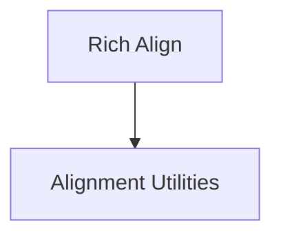

# Alignment Utilities Module (`alignment_utilities`)

## Introduction

The `alignment_utilities` module provides essential classes for controlling the alignment of renderables within the Rich terminal UI. It allows developers to precisely position text and other Rich components, ensuring a visually organized and aesthetically pleasing output. This module is a core part of `rich_align`, providing the fundamental alignment primitives.

## Architecture

The `alignment_utilities` module is a simple, focused collection of classes that enable various alignment strategies. It operates by wrapping other Rich renderables and adjusting their position based on the available width or height. It's designed to be used in conjunction with other Rich components that need specific positioning.

It directly depends on the core `rich_align` module and can be integrated into any Rich application requiring layout control.

<!-- DIAGRAM_JSON
{
    "direction": "TD",
    "nodes": [
        {"id": "alignment_utilities", "label": "Alignment Utilities", "type": "module", "link": "alignment_utilities.md"},
        {"id": "rich_align", "label": "Rich Align", "type": "module", "link": "rich_align.md"}
    ],
    "edges": [
        {"source": "rich_align", "target": "alignment_utilities"}
    ],
    "groups": []
}
-->

## Core Functionality

This module exposes classes for horizontal and vertical alignment:

### Align

The `Align` class is used to horizontally align a Rich renderable within a given width. It supports left, center, and right alignment options.

### VerticalCenter

The `VerticalCenter` class is designed to vertically center a Rich renderable. This is particularly useful for ensuring content is centered within a specific height, often in conjunction with other layout managers.

## How it fits into the overall system

The `alignment_utilities` module provides the foundational alignment logic for the Rich library. It is typically utilized by higher-level layout components (such as `Columns`, `Panel`, or custom renderables) to achieve precise positioning of their content. By encapsulating alignment concerns, it promotes modularity and reusability across the Rich ecosystem. For more details on its parent module, refer to the [rich_align documentation](rich_align.md).
