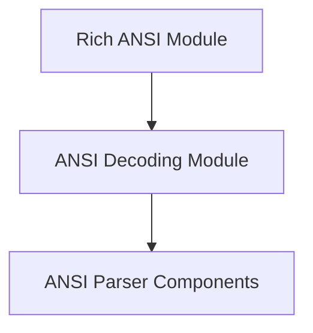

# ANSI Components Module

## Introduction
The `ansi_components` module serves as a foundational element within the Rich library, specifically designed to handle the parsing and interpretation of ANSI escape sequences. It provides the core mechanisms required to convert raw ANSI-encoded text into structured data that can be rendered by Rich. This module is critical for enabling Rich to correctly display styled text, colors, and cursor movements originating from terminals or other sources that utilize ANSI standards.

## Architecture Overview
The `ansi_components` module is an integral part of the larger `rich_ansi` and `ansi_decoding` family of modules. It resides at the core of the ANSI processing pipeline, receiving input that may contain ANSI escape codes and breaking them down into manageable tokens for further processing.

It directly contributes to the functionality of its parent `ansi_decoding` module, which in turn is a sub-module of `rich_ansi`. The `ansi_parser_components` sub-module, detailed below, contains the low-level components responsible for this crucial decoding work.

<!-- DIAGRAM_JSON
{
    "direction": "TD",
    "nodes": [
        {"id": "rich_ansi", "label": "Rich ANSI Module", "type": "external", "link": "rich_ansi.md"},
        {"id": "ansi_decoding", "label": "ANSI Decoding Module", "type": "external", "link": "ansi_decoding.md"},
        {"id": "ansi_parser_components", "label": "ANSI Parser Components", "type": "module", "link": "ansi_parser_components.md"}
    ],
    "edges": [
        {"source": "rich_ansi", "target": "ansi_decoding"},
        {"source": "ansi_decoding", "target": "ansi_parser_components"}
    ],
    "groups": []
}
-->

## High-Level Functionality

### [ANSI Parser Components](ansi_parser_components.md)
This sub-module contains the core logic for tokenizing and decoding ANSI escape sequences. It defines structures like `_AnsiToken` to represent individual ANSI control codes and `AnsiDecoder` for orchestrating the parsing process. It is fundamental for converting raw terminal output into a format Rich can understand and render.
