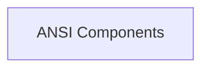

# ANSI Decoding Module

The `ansi_decoding` module provides functionality for parsing and interpreting ANSI escape codes found within strings, enabling Rich to render styled text correctly in various terminal environments.

## Architecture Overview

The `ansi_decoding` module is composed of a single sub-module, `ansi_components`, which encapsulates the logic for tokenizing and decoding ANSI escape sequences. This module works in conjunction with the `rich_ansi` module (specifically the `_AnsiToken` and `AnsiDecoder` components mentioned in `rich_ansi` parent module) to convert raw ANSI-encoded strings into a format that Rich can use to apply styles, colors, and other formatting to terminal output.

<!-- DIAGRAM_JSON
{
    "direction": "TD",
    "nodes": [
        {"id": "ansi_components", "label": "ANSI Components", "type": "module", "link": "ansi_components.md"}
    ],
    "edges": [],
    "groups": []
}
-->

## Sub-modules

*   [ANSI Components](ansi_components.md): Contains core components for parsing and decoding ANSI escape codes, including the `_AnsiToken` and `AnsiDecoder` classes.