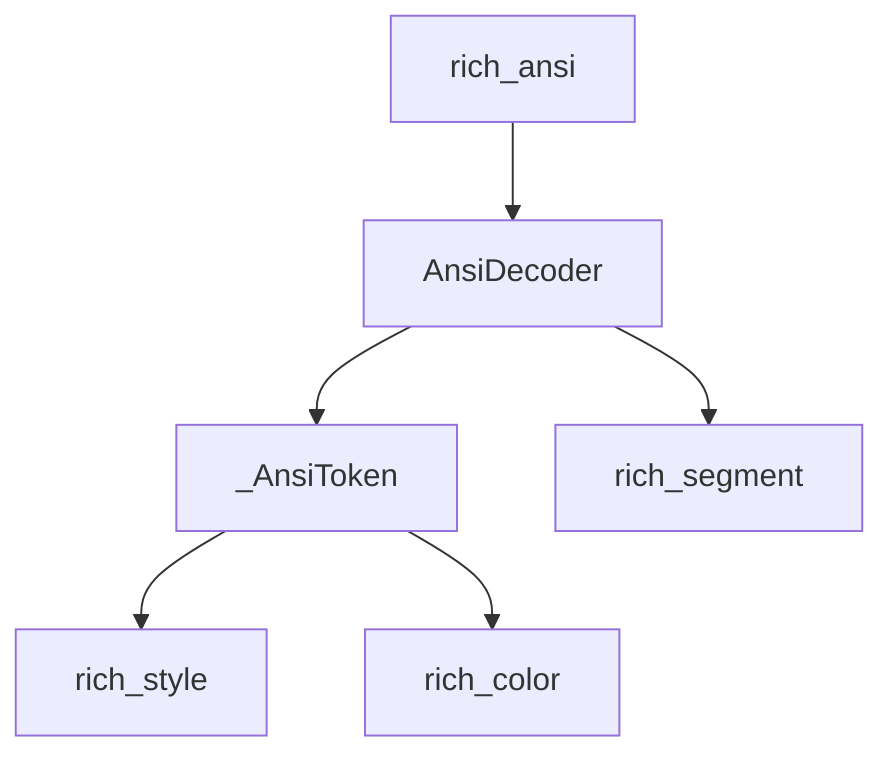

# ansi_parser_components Module Documentation

## Introduction

The `ansi_parser_components` module is a foundational component within the `rich` library, responsible for the low-level parsing of ANSI escape codes. It defines the fundamental building blocks used to interpret and convert raw ANSI-formatted strings into structured components. This module specifically provides the `_AnsiToken` and `AnsiDecoder` classes, which are crucial for breaking down complex ANSI sequences into manageable units for subsequent processing and rendering by other parts of the `rich` library.

## Architecture and Component Relationships

This module serves as the bedrock for handling ANSI content, abstracting away the complexities of escape code parsing. The `AnsiDecoder` processes input text, emitting `_AnsiToken` objects that represent parsed ANSI sequences or plain text segments. These tokens can then be further processed by higher-level modules, such as `ansi_decoding` or `rich_ansi`, to construct renderable `rich` objects like `Text` or `Segment`.

<!-- DIAGRAM_JSON
{
    "direction": "TD",
    "nodes": [
        {"id": "ansi_decoder", "label": "AnsiDecoder", "type": "component", "link": null},
        {"id": "ansi_token", "label": "_AnsiToken", "type": "component", "link": null},
        {"id": "rich_ansi", "label": "rich_ansi", "type": "external", "link": "rich_ansi.md"},
        {"id": "rich_style", "label": "rich_style", "type": "external", "link": "rich_style.md"},
        {"id": "rich_color", "label": "rich_color", "type": "external", "link": "rich_color.md"},
        {"id": "rich_segment", "label": "rich_segment", "type": "external", "link": "rich_segment.md"}
    ],
    "edges": [
        {"source": "ansi_decoder", "target": "ansi_token"},
        {"source": "rich_ansi", "target": "ansi_decoder"},
        {"source": "ansi_token", "target": "rich_style"},
        {"source": "ansi_token", "target": "rich_color"},
        {"source": "ansi_decoder", "target": "rich_segment"}
    ],
    "groups": []
}
-->

### Core Components

*   **`_AnsiToken`**: Represents a single parsed unit from an ANSI string. This could be a plain text segment, an ANSI style change (e.g., bold, italic), a color change (foreground or background), or other control sequences. It encapsulates the type of ANSI event and any associated data (like the specific style or color). `_AnsiToken` objects are designed to be lightweight and easily processed.

*   **`AnsiDecoder`**: This class is responsible for iterating over a string, identifying ANSI escape sequences, and yielding `_AnsiToken` objects. It handles the state management required to correctly interpret complex and nested ANSI codes. The `AnsiDecoder` effectively translates a raw ANSI string into a stream of meaningful tokens that higher-level components can consume.

## Integration with the Overall System

`ansi_parser_components` provides the lowest-level parsing capabilities for ANSI text. It is directly utilized by modules such as [ansi_decoding](ansi_decoding.md) and ultimately feeds into the [rich_ansi](rich_ansi.md) module, which orchestrates the complete ANSI rendering process within the `rich` library. The `_AnsiToken` objects it produces are fundamental for constructing `Style` objects (from [rich_style](rich_style.md)) and `Color` objects (from [rich_color](rich_color.md)), which are then used to create renderable `Segment` objects (from [rich_segment](rich_segment.md)) that the [rich_console](rich_console.md) can display. This module ensures that `rich` can correctly interpret and render text formatted with ANSI escape codes across various terminals.