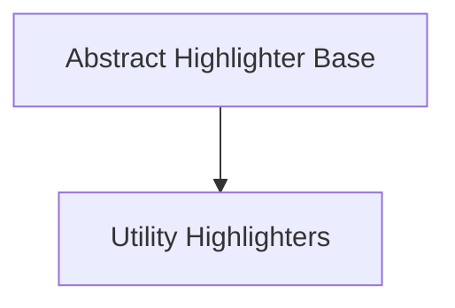

# Base Highlighters Module

The `base_highlighters` module in the `rich` library provides the foundational components for text highlighting. It defines the abstract `Highlighter` class, which serves as the base for all specific highlighters, and includes concrete utility highlighters for common use cases like Python `repr()` output and a no-operation highlighter.

## Architecture

The architecture of the `base_highlighters` module is straightforward, focusing on extensibility and common utility. It establishes the core contract for highlighting and provides practical implementations.

<!-- DIAGRAM_JSON
{
    "direction": "TD",
    "nodes": [
        {"id": "abstract_highlighter", "label": "Abstract Highlighter Base", "type": "module", "link": "abstract_highlighter.md"},
        {"id": "utility_highlighters", "label": "Utility Highlighters", "type": "module", "link": "utility_highlighters.md"}
    ],
    "edges": [
        {"source": "abstract_highlighter", "target": "utility_highlighters"}
    ],
    "groups": []
}
-->

## Sub-modules

This module is composed of the following sub-modules:

### [Abstract Highlighter Base](abstract_highlighter.md)
This sub-module defines the `Highlighter` abstract base class, which is the foundation for all highlighters in the `rich` library. It outlines the interface and common behavior that concrete highlighter implementations must adhere to.

### [Utility Highlighters](utility_highlighters.md)
This sub-module provides practical highlighter implementations, including `ReprHighlighter` for automatically highlighting Python `repr()` strings, and `NullHighlighter`, which acts as a no-operation highlighter, passing text through without modification.
