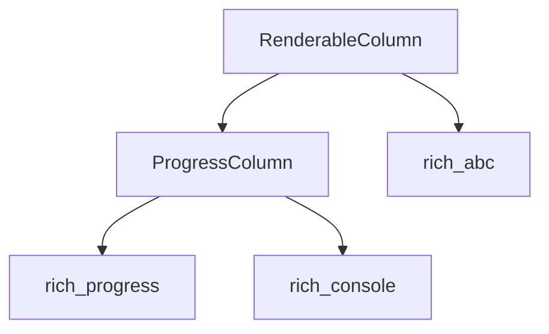

The `base_progress_columns` module serves as the foundational layer for defining columns within the `rich.progress.Progress` display. It provides the essential abstract base classes, `ProgressColumn` and `RenderableColumn`, which establish the interface and core functionality for all progress bar columns. These base classes ensure a consistent structure for how progress information is presented visually.

### Architecture Diagram

<!-- DIAGRAM_JSON
{
    "direction": "TD",
    "nodes": [
        {"id": "progress_column", "label": "ProgressColumn", "type": "component", "link": null},
        {"id": "renderable_column", "label": "RenderableColumn", "type": "component", "link": null},
        {"id": "rich_progress", "label": "rich_progress", "type": "external", "link": "rich_progress.md"},
        {"id": "rich_console", "label": "rich_console", "type": "external", "link": "rich_console.md"},
        {"id": "rich_abc", "label": "rich_abc", "type": "external", "link": "rich_abc.md"}
    ],
    "edges": [
        {"source": "renderable_column", "target": "progress_column"},
        {"source": "progress_column", "target": "rich_progress"},
        {"source": "progress_column", "target": "rich_console"},
        {"source": "renderable_column", "target": "rich_abc"}
    ],
    "groups": []
}
-->

### Module Overview

The `base_progress_columns` module is designed to be highly extensible, allowing developers to create custom progress bar columns by inheriting from its base classes. It abstracts away the complexities of rendering and task state management, providing a clean interface for column implementation.

#### Core Components

##### `ProgressColumn`

The `ProgressColumn` class is an abstract base class that defines the contract for any column displayed within a `rich.progress.Progress` instance. It provides methods that subclasses must implement to render their content based on the current state of a `rich_progress.Task`.

*   **Purpose**: To provide a standardized interface for progress bar columns.
*   **Key Responsibilities**: 
    *   Define how a column should render itself given a `rich_progress.Task` and `rich_console.ConsoleOptions`.
    *   Handle measurement of its rendered width.
*   **Dependencies**:
    *   Relies on `rich_progress` for task-related data.
    *   Uses `rich_console` for rendering capabilities and console options.

##### `RenderableColumn`

The `RenderableColumn` class is a concrete implementation of `ProgressColumn` that specializes in rendering a `rich_abc.RichRenderable` object. This class allows for flexible content within a progress column by delegating the actual rendering to a separate renderable object.

*   **Purpose**: To display any `rich` renderable object as a progress column.
*   **Key Responsibilities**: 
    *   Wrap and render a `rich_abc.RichRenderable` instance.
    *   Adhere to the `ProgressColumn` interface.
*   **Dependencies**:
    *   Inherits from `ProgressColumn`.
    *   Depends on `rich_abc.RichRenderable` for the content it displays.
    *   Leverages `rich_console` for rendering the internal renderable.

### Relationship to the Overall System

This module is a critical part of the `rich_progress` ecosystem. It sits beneath the [concrete_progress_columns.md](concrete_progress_columns.md) module, which implements various predefined progress columns (e.g., `TextColumn`, `SpinnerColumn`, `BarColumn`) by extending `ProgressColumn` and `RenderableColumn`.

By providing stable base classes, `base_progress_columns` ensures that all progress columns, whether built-in or custom, integrate seamlessly with the `rich_progress.Progress` display. It establishes the architectural foundation for how progress information is visually structured and updated in the terminal.