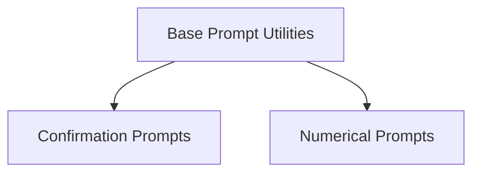

# base_prompt_handling Module Documentation

## Introduction

The `base_prompt_handling` module provides the foundational classes and utilities for creating interactive prompts within the Rich library. It defines the core logic for rendering prompts and handling user input, serving as the base for more specialized prompt types like confirmation and numerical prompts.

## Architecture

The `base_prompt_handling` module is structured around its core prompt utilities, which are then extended by specific prompt implementations. It integrates with other Rich modules to provide a consistent and rich user experience for interactive command-line interfaces.

<!-- DIAGRAM_JSON
{
    "direction": "TD",
    "nodes": [
        {"id": "base_prompt_utilities", "label": "Base Prompt Utilities", "type": "module", "link": "base_prompt_utilities.md"},
        {"id": "confirmation_prompts", "label": "Confirmation Prompts", "type": "module", "link": "confirmation_prompts.md"},
        {"id": "numerical_prompts", "label": "Numerical Prompts", "type": "module", "link": "numerical_prompts.md"}
    ],
    "edges": [
        {"source": "base_prompt_utilities", "target": "confirmation_prompts"},
        {"source": "base_prompt_utilities", "target": "numerical_prompts"}
    ],
    "groups": []
}
-->

## Sub-modules and Core Functionality

This module orchestrates the core mechanisms for displaying prompts and processing input.

### [Base Prompt Utilities](base_prompt_utilities.md)
This sub-module defines the `Prompt` and `PromptBase` classes, which are the fundamental building blocks for any interactive prompt. It encapsulates common prompt behaviors, rendering, and input handling logic.

### Related Modules

*   **[Confirmation Prompts](confirmation_prompts.md)**: This module provides functionality for handling yes/no or true/false confirmation prompts, extending the `PromptBase` class.
*   **[Numerical Prompts](numerical_prompts.md)**: This module offers specialized prompts for numerical input, such as integers and floating-point numbers, building upon the base prompt handling.