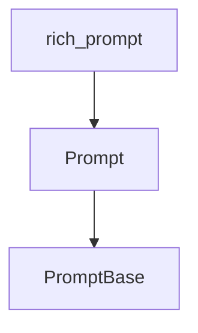

# `base_prompt_utilities`

The `base_prompt_utilities` module provides the foundational classes and utilities for creating and managing prompts within the `rich` library. It defines the core interfaces and shared logic that more specific prompt types (like `Confirm`, `IntPrompt`, `FloatPrompt`) build upon.

## Architecture and Component Relationships

This module contains the fundamental `Prompt` and `PromptBase` classes, which serve as the bedrock for all interactive prompt functionalities in `rich`. It is a leaf module within the `rich_prompt` hierarchy, encapsulating the basic mechanics of prompt handling.

<!-- DIAGRAM_JSON
{
    "direction": "TD",
    "nodes": [
        {"id": "Prompt", "label": "Prompt", "type": "component", "link": null},
        {"id": "PromptBase", "label": "PromptBase", "type": "component", "link": null},
        {"id": "rich_prompt", "label": "rich_prompt", "type": "external", "link": "rich_prompt.md"}
    ],
    "edges": [
        {"source": "Prompt", "target": "PromptBase"},
        {"source": "rich_prompt", "target": "Prompt"}
    ],
    "groups": []
}
-->

## How it fits into the overall system

The `base_prompt_utilities` module is a critical foundational component of the `rich` library's interactive capabilities. By providing the base `Prompt` and `PromptBase` classes, it ensures a consistent and extensible framework for user input. Other prompt-related modules, such as [rich_prompt](rich_prompt.md) and its sub-modules like `confirmation_prompts` and `numerical_prompts`, directly leverage these utilities to implement their specific interactive behaviors. This hierarchical structure allows for easy extension and maintenance of new prompt types while maintaining a unified interface for developers.
