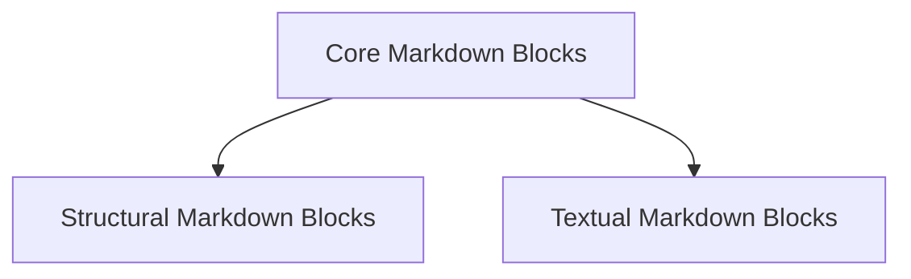

# Basic Markdown Blocks Module Documentation

The `basic_markdown_blocks` module, part of the `rich_markdown.markdown_elements` sub-system, provides the foundational components for rendering and interpreting basic Markdown syntax. It defines the core elements that form the structure and content of simple Markdown documents, ensuring consistent parsing and display within the Rich library.

## Architecture Overview

This module is composed of several key sub-modules, each responsible for a specific category of Markdown elements. The overall architecture is designed to be modular and extensible, allowing for easy addition of new Markdown features.

<!-- DIAGRAM_JSON
{
    "direction": "TD",
    "nodes": [
        {"id": "core_markdown_blocks", "label": "Core Markdown Blocks", "type": "module", "link": "core_markdown_blocks.md"},
        {"id": "structural_markdown_blocks", "label": "Structural Markdown Blocks", "type": "module", "link": "structural_markdown_blocks.md"},
        {"id": "textual_markdown_blocks", "label": "Textual Markdown Blocks", "type": "module", "link": "textual_markdown_blocks.md"}
    ],
    "edges": [
        {"source": "core_markdown_blocks", "target": "structural_markdown_blocks"},
        {"source": "core_markdown_blocks", "target": "textual_markdown_blocks"}
    ],
    "groups": []
}
-->

## Sub-modules

### Core Markdown Blocks ([core_markdown_blocks.md](core_markdown_blocks.md))
Handles the most fundamental Markdown elements, including generic `MarkdownElement` and `UnknownElement` for parsing flexibility.

### Structural Markdown Blocks ([structural_markdown_blocks.md](structural_markdown_blocks.md))
Manages elements that provide structure to Markdown content, such as `Heading` for titles, `HorizontalRule` for thematic breaks, and `BlockQuote` for quoted text.

### Textual Markdown Blocks ([textual_markdown_blocks.md](textual_markdown_blocks.md))
Deals with Markdown elements primarily focused on textual content and linking, encompassing `Link` for hyperlinks and `Paragraph` for standard text blocks.
