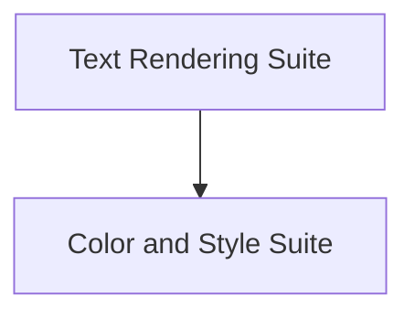

# `basic_rendering_benchmarks` Module Documentation

## Introduction

The `basic_rendering_benchmarks` module is designed to provide performance benchmarks for fundamental rendering operations within the Rich library. It focuses on evaluating the efficiency of core components related to text, segments, colors, and styles, which are crucial for rendering rich content to the terminal.

## Architecture Overview

The module is structured into several suites, each targeting specific rendering aspects. These suites are organized to allow for isolated testing and performance measurement of key functionalities. The main components within this module are grouped into the `text_rendering_suite` and `color_style_suite` sub-modules, as detailed below.

<!-- DIAGRAM_JSON
{
    "direction": "TD",
    "nodes": [
        {"id": "text_rendering_suite", "label": "Text Rendering Suite", "type": "module", "link": "text_rendering_suite.md"},
        {"id": "color_style_suite", "label": "Color and Style Suite", "type": "module", "link": "color_style_suite.md"}
    ],
    "edges": [
        {"source": "text_rendering_suite", "target": "color_style_suite"}
    ],
    "groups": []
}
-->

## Sub-modules

### [Text Rendering Suite](text_rendering_suite.md)
This sub-module contains benchmarks for evaluating the performance of segment, text, and text hot cache rendering operations.

### [Color and Style Suite](color_style_suite.md)
This sub-module includes benchmarks focused on assessing the efficiency of color, style, and cached color rendering functionalities.
