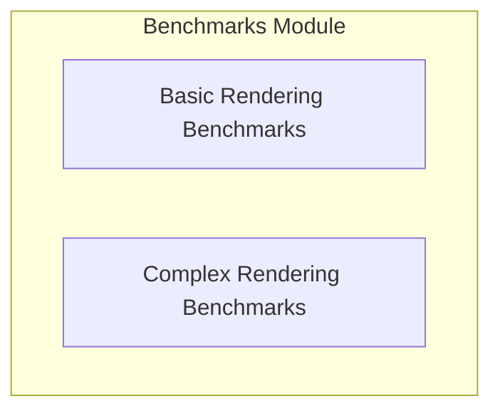

# Benchmarks Module Documentation

## Introduction and Purpose

The `benchmarks` module is dedicated to performance testing and analysis of the Rich library. It houses a collection of benchmark suites designed to measure the efficiency and speed of various Rich components, from basic text rendering to complex elements like syntax highlighting and tables. This ensures the library maintains optimal performance and helps identify areas for optimization.

## Architecture Overview

The `benchmarks` module is organized into specialized sub-modules, each containing a set of benchmark suites targeting specific functionalities within the Rich library. These sub-modules operate largely independently, focusing on distinct aspects of rendering performance without direct architectural dependencies on each other. They collectively contribute to a holistic understanding of the library's performance characteristics.

<!-- DIAGRAM_JSON
{
    "direction": "TD",
    "nodes": [
        {"id": "basic_rendering_benchmarks", "label": "Basic Rendering Benchmarks", "type": "module", "link": "basic_rendering_benchmarks.md"},
        {"id": "complex_rendering_benchmarks", "label": "Complex Rendering Benchmarks", "type": "module", "link": "complex_rendering_benchmarks.md"}
    ],
    "edges": [],
    "groups": []
}
-->

## Sub-module Functionality

### Basic Rendering Benchmarks

This sub-module contains suites for benchmarking fundamental Rich rendering operations. It covers the performance of rendering segments, various color configurations, applying styles, and the efficiency of text caching mechanisms.

For a detailed understanding, refer to the [Basic Rendering Benchmarks documentation](basic_rendering_benchmarks.md).

### Complex Rendering Benchmarks

This sub-module focuses on the performance of more sophisticated Rich rendering features. It includes benchmarks for syntax highlighting, the pretty printing of Python objects, and the rendering of tabular data structures.

For a detailed understanding, refer to the [Complex Rendering Benchmarks documentation](complex_rendering_benchmarks.md).
