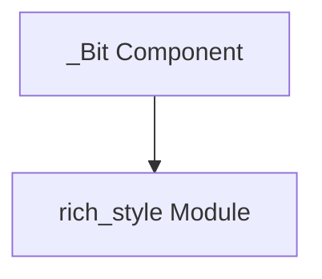

# `bit_utility` Module Documentation

## Introduction

The `bit_utility` module, a sub-module of `rich_style`, provides the fundamental `_Bit` component. This component is crucial for the efficient and compact representation of style attributes within the Rich library, particularly for managing various display styles like bold, italic, underline, and color.

## Architecture and Component Relationships

The `bit_utility` module primarily encapsulates the `_Bit` component, which serves as a low-level utility for managing style flags. It is designed to be integrated and utilized by the broader `rich_style` module to construct and manipulate complex style objects.

### Core Components

*   `_Bit`: This component is likely a bitfield or an enum that represents individual style attributes as distinct bits. This allows for efficient storage and manipulation of multiple style properties using bitwise operations, offering performance benefits in rendering and style application.

<!-- DIAGRAM_JSON
{
    "direction": "TD",
    "nodes": [
        {"id": "_bit", "label": "_Bit Component", "type": "component", "link": null},
        {"id": "rich_style", "label": "rich_style Module", "type": "external", "link": "rich_style.md"}
    ],
    "edges": [
        {"source": "_bit", "target": "rich_style"}
    ],
    "groups": []
}
-->

## How it Fits into the Overall System

The `bit_utility` module, through its `_Bit` component, is a foundational element for the `rich_style` module. It enables `rich_style` to efficiently encode and decode various rendering styles, ensuring that Rich can apply diverse formatting with minimal overhead. Other modules that depend on `rich_style` for rendering text with specific attributes indirectly rely on `bit_utility` for its underlying bitwise style management. This low-level optimization contributes to the overall performance and flexibility of Rich's text rendering capabilities.
