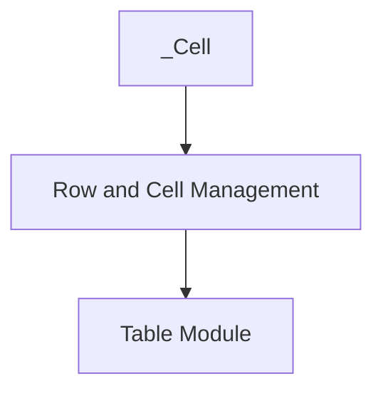

# cell_management Module Documentation

## Introduction

The `cell_management` module is a fundamental component within the Rich library's table rendering system. It is specifically responsible for defining and managing the basic unit of a table: the cell. This module encapsulates the `_Cell` core component, which represents an individual cell within a table structure, holding its content and associated metadata for rendering.

## Architecture and Component Relationships

This module is a leaf node in the table rendering hierarchy, providing the granular definition of a table cell. It directly contributes to the functionality of the `row_and_cell_management` module, which in turn is part of the broader `rich_table` module responsible for orchestrating the entire table rendering process.

<!-- DIAGRAM_JSON
{
    "direction": "TD",
    "nodes": [
        {"id": "_cell", "label": "_Cell", "type": "component", "link": null},
        {"id": "row_and_cell_management", "label": "Row and Cell Management", "type": "external", "link": "row_and_cell_management.md"},
        {"id": "rich_table", "label": "Table Module", "type": "external", "link": "rich_table.md"}
    ],
    "edges": [
        {"source": "_cell", "target": "row_and_cell_management"},
        {"source": "row_and_cell_management", "target": "rich_table"}
    ],
    "groups": []
}
-->

## Core Functionality

The `cell_management` module's primary role is to define the `_Cell` object. The `_Cell` component holds the renderable content that belongs within a single grid unit of a table. It acts as a data structure to store the content and potentially other cell-specific properties that influence how it's displayed within a table.

### `_Cell`

The `_Cell` component is an internal representation of a table cell. It typically encapsulates:

*   **Renderable content**: The actual object or text that needs to be displayed in the cell.
*   **Width/Height information**: Properties that might be calculated during the layout phase to determine the cell's dimensions.
*   **Style information**: Any specific styling applied to the cell's content.

This component is crucial for the `rich_table` module to correctly lay out and render tables by providing a standardized way to manage individual cell data.

## Integration with the Overall System

`cell_management` provides the foundational `_Cell` object which is then utilized by higher-level modules to construct and render complex table structures. It is an integral part of Rich's robust table rendering engine:

*   **`row_and_cell_management`**: This parent module uses `_Cell` instances to aggregate them into rows, forming the horizontal structure of a table. It manages the collection and arrangement of cells within a row.
*   **`rich_table`**: The top-level `Table` component in `rich_table` relies on the cell and row management to build the complete table. It orchestrates how `_Cell` objects are rendered, respecting column widths, styles, and other table-level properties.

By isolating cell-specific logic, the `cell_management` module ensures modularity and maintainability within the Rich table rendering system, allowing for clear separation of concerns in handling the smallest building block of a table.