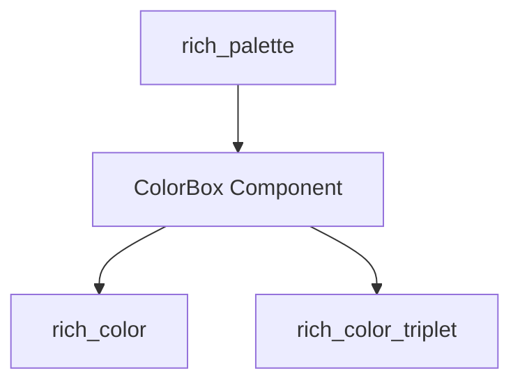

# color_box_representation Module Documentation

## Introduction

The `color_box_representation` module is a focused component responsible for defining and managing the `ColorBox` entity. This module provides the foundational structure for representing individual colors within the Rich library's ecosystem, particularly in the context of color palettes and terminal rendering.

## Comprehensive Documentation

### Purpose and Core Functionality

The primary purpose of the `color_box_representation` module is to encapsulate the `ColorBox` component. `ColorBox` serves as a fundamental data structure for holding detailed information about a single color, including its various representations (e.g., RGB, hex). While the specific methods and properties are not detailed here due to the absence of core component code, its role is to facilitate the consistent and efficient handling of color data throughout the Rich library.

### Architecture and Component Relationships

The `color_box_representation` module is a leaf module, centered around its core component, `ColorBox`. It is a specialized part of the broader `rich_palette` module, which manages collections of these `ColorBox` instances.

The `ColorBox` component relies on other modules for fundamental color definitions and structures:

*   **`rich_color`**: Provides general color types and systems, such as `ColorType` and `Color`, which `ColorBox` likely uses to define the nature of the color it represents.
*   **`rich_color_triplet`**: Offers specific structures for color values, such as `ColorTriplet` (e.g., for RGB values), which `ColorBox` would use to store the actual color data.

<!-- DIAGRAM_JSON
{
    "direction": "TD",
    "nodes": [
        {"id": "color_box_component", "label": "ColorBox Component", "type": "component", "link": null},
        {"id": "rich_palette_module", "label": "rich_palette", "type": "external", "link": "rich_palette.md"},
        {"id": "rich_color_module", "label": "rich_color", "type": "external", "link": "rich_color.md"},
        {"id": "rich_color_triplet_module", "label": "rich_color_triplet", "type": "external", "link": "rich_color_triplet.md"}
    ],
    "edges": [
        {"source": "rich_palette_module", "target": "color_box_component"},
        {"source": "color_box_component", "target": "rich_color_module"},
        {"source": "color_box_component", "target": "rich_color_triplet_module"}
    ],
    "groups": []
}
-->

### How the Module Fits into the Overall System

The `color_box_representation` module, through its `ColorBox` component, serves as a fundamental building block for any part of the Rich library that needs to manage or display individual colors. It is directly consumed by the `rich_palette` module to construct and organize complete color palettes. By providing a standardized representation for colors, this module ensures consistency and simplifies color handling across various Rich components that deal with styling and visual output, such as text rendering, console logging, and interactive elements.