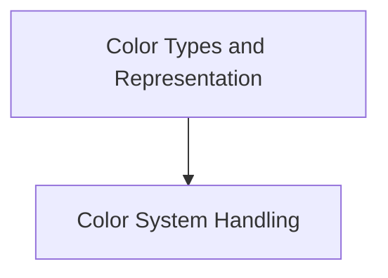

# Color Definition Module

The `color_definition` module in Rich is responsible for defining the fundamental types and representations of colors used throughout the library. It provides the building blocks for handling various color systems and individual color values, ensuring consistent color management across different components.

## Architecture Overview

The `color_definition` module is a small, focused module that primarily defines data structures related to colors. It works in conjunction with other modules in the `rich_color` package, particularly `color_system_handling`, to provide a complete color management system.

<!-- DIAGRAM_JSON
{
    "direction": "TD",
    "nodes": [
        {"id": "color_types", "label": "Color Types and Representation", "type": "module", "link": "color_types.md"},
        {"id": "rich_color.ColorSystem", "label": "Color System Handling", "type": "module", "link": "color_system_handling.md"}
    ],
    "edges": [
        {"source": "color_types", "target": "rich_color.ColorSystem"}
    ],
    "groups": []
}
-->

## Sub-modules

### [Color Types and Representation](color_types.md)

This sub-module, documented in `color_types.md`, defines the core enums and classes for representing colors within Rich. It includes `rich_color.ColorType` for specifying the type of color (e.g., standard, extended, true color) and `rich_color.Color` for encapsulating individual color values and their associated color system.

### [Color System Handling](color_system_handling.md)

This module, documented in `color_system_handling.md`, is responsible for managing and determining the available color capabilities of the terminal. It handles the logic for detecting the most appropriate color system based on the environment and terminal support. It uses the color definitions provided by `color_definition` to interpret and apply colors correctly.