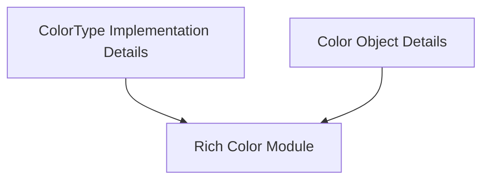

# Module: `color_definition_details`

## Introduction

The `color_definition_details` module is a crucial leaf module within the `rich_color` ecosystem, specifically nested under `rich_color.color_definition.color_types`. Its primary purpose is to provide detailed definitions and handling mechanisms for fundamental color components, namely `ColorType` and `Color`, which are initially introduced in the parent `rich_color` module. This module ensures that specific aspects and nuances of color representation and manipulation are thoroughly addressed.

## Architecture and Component Relationships

This module focuses on the detailed implementation and specification of `ColorType` and `Color` within the Rich library. It acts as an extension to the core definitions provided by the `rich_color` module, offering a granular level of control and clarity over how colors are defined and utilized throughout the system.

<!-- DIAGRAM_JSON
{
    "direction": "TD",
    "nodes": [
        {"id": "color_type_implementation", "label": "ColorType Implementation Details", "type": "component", "link": null},
        {"id": "color_object_details", "label": "Color Object Details", "type": "component", "link": null},
        {"id": "rich_color", "label": "Rich Color Module", "type": "external", "link": "rich_color.md"}
    ],
    "edges": [
        {"source": "color_type_implementation", "target": "rich_color"},
        {"source": "color_object_details", "target": "rich_color"}
    ],
    "groups": []
}
-->

**Components:**

*   **ColorType Implementation Details**: This represents the specific detailed handling or additional properties related to `ColorType` within this module. It expands upon the basic `ColorType` enum/definition found in `rich_color`.
*   **Color Object Details**: This component encapsulates the detailed aspects and specific behaviors of the `Color` object, building upon its foundational definition in `rich_color`.

**Dependencies:**

*   **rich_color**: The `color_definition_details` module directly depends on the `rich_color` module, as it provides the foundational `ColorType` and `Color` classes that this module elaborates upon. Refer to the [rich_color documentation](rich_color.md) for more details on the base color definitions.

## How the Module Fits into the Overall System

The `color_definition_details` module plays a vital role in maintaining the robustness and flexibility of the Rich library's color system. By providing detailed specifications for `ColorType` and `Color`, it ensures that the library can handle a wide array of color representations, from basic named colors to intricate true-color definitions. It serves as the granular layer that translates abstract color concepts into concrete, manageable structures used by other modules for rendering and display. This module is essential for consistent and accurate color reproduction across different terminal environments and user configurations, ensuring that all visual elements within Rich are presented as intended.