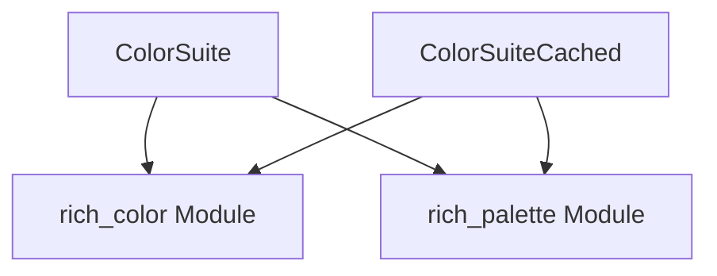

# `color_management` Module Documentation

The `color_management` module is a crucial part of the `basic_rendering_benchmarks` suite, specifically focusing on the performance aspects of color handling and styling within the system. It provides dedicated benchmark suites, `ColorSuite` and `ColorSuiteCached`, to evaluate the efficiency of color-related operations, including those leveraging caching mechanisms.

## Purpose and Core Functionality

The primary purpose of the `color_management` module is to rigorously benchmark how the system processes and applies colors. This includes:

*   **Color Application Benchmarking**: Measuring the performance of applying various color types to text and other renderable elements.
*   **Caching Efficiency Evaluation**: Assessing the impact and effectiveness of color caching strategies on rendering performance through `ColorSuiteCached`.
*   **Performance Regression Detection**: Helping to identify performance bottlenecks or regressions related to color processing as the system evolves.

By focusing on these areas, the module ensures that color rendering remains performant and that any optimizations or new features in color handling are thoroughly evaluated for their impact on system speed.

## Architecture and Component Relationships

The `color_management` module contains two core benchmarking components: `ColorSuite` and `ColorSuiteCached`. These components are designed to interact with the core color definitions and utilities provided by external modules like `rich_color` and potentially `rich_palette`.

*   **`ColorSuite`**: This component benchmarks fundamental color application operations. It likely tests various scenarios of assigning and rendering colors without explicit caching considerations.
*   **`ColorSuiteCached`**: This component specifically benchmarks color operations where caching mechanisms are involved. It helps in understanding the performance benefits or overhead associated with cached color lookups and applications.

Both suites depend on the foundational `Color` objects and related utilities defined in the `rich_color` module. They might also interact with `rich_palette` for operations involving predefined color sets.

<!-- DIAGRAM_JSON
{
    "direction": "TD",
    "nodes": [
        {"id": "color_suite", "label": "ColorSuite", "type": "component", "link": null},
        {"id": "color_suite_cached", "label": "ColorSuiteCached", "type": "component", "link": null},
        {"id": "rich_color", "label": "rich_color Module", "type": "external", "link": "rich_color.md"},
        {"id": "rich_palette", "label": "rich_palette Module", "type": "external", "link": "rich_palette.md"}
    ],
    "edges": [
        {"source": "color_suite", "target": "rich_color"},
        {"source": "color_suite_cached", "target": "rich_color"},
        {"source": "color_suite", "target": "rich_palette"},
        {"source": "color_suite_cached", "target": "rich_palette"}
    ],
    "groups": []
}
-->

## How the Module Fits into the Overall System

The `color_management` module is a leaf module within the `benchmarks` hierarchy. It resides under `benchmarks/basic_rendering_benchmarks/color_style_suite`, indicating its specialized role in benchmarking basic rendering features related to color and style.

It provides critical performance insights for the `rich` library's rendering engine, particularly concerning how colors are processed and applied. By benchmarking these operations, it directly contributes to maintaining and improving the responsiveness and efficiency of the library's output. The results from these benchmarks inform development decisions regarding color system optimizations and impact the overall user experience by ensuring fast and fluid terminal rendering.

For broader context on basic rendering benchmarks, refer to the [basic_rendering_benchmarks module documentation](basic_rendering_benchmarks.md). For details on the `Color` objects and related color systems, consult the [rich_color module documentation](rich_color.md). Information on color palettes can be found in the [rich_palette module documentation](rich_palette.md).
