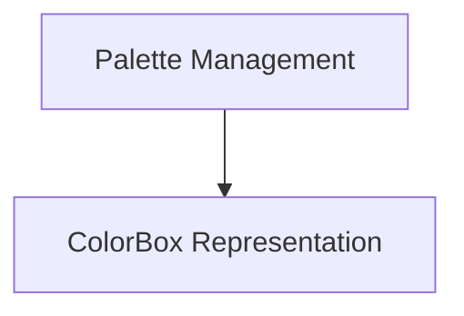

# Color Palette Management

The `color_palette_management` module is responsible for defining, managing, and utilizing color palettes throughout the system. It ensures consistent color usage and provides foundational components for color representation and organization.

## Architecture Overview

The `color_palette_management` module is structured into two primary sub-modules, each handling a distinct aspect of color management:

- **[Palette Management](palette_management.md)**: This sub-module focuses on the creation, storage, and retrieval of color collections.
- **[ColorBox Representation](color_box_representation.md)**: This sub-module defines how individual colors are represented and encapsulated.

### Module Diagram

<!-- DIAGRAM_JSON
{
    "direction": "TD",
    "nodes": [
        {"id": "palette_management", "label": "Palette Management", "type": "module", "link": "palette_management.md"},
        {"id": "color_box_representation", "label": "ColorBox Representation", "type": "module", "link": "color_box_representation.md"}
    ],
    "edges": [
        {"source": "palette_management", "target": "color_box_representation"}
    ],
    "groups": []
}
-->

