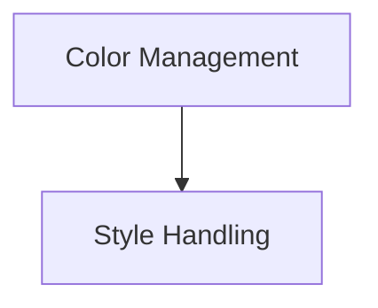

# Color Style Suite

## Introduction
The `color_style_suite` module, part of the `basic_rendering_benchmarks` within the Rich library, is designed to benchmark and evaluate the performance of color and style application. It provides a focused environment for testing the efficiency of various color management and text styling operations, crucial for optimizing rendering performance.

## Architecture Overview
The `color_style_suite` module is structured into two main sub-modules: `color_management` and `style_handling`. These sub-modules encapsulate the core functionalities related to handling visual presentation, ensuring modularity and clear separation of concerns.

<!-- DIAGRAM_JSON
{
    "direction": "TD",
    "nodes": [
        {"id": "color_management", "label": "Color Management", "type": "module", "link": "color_management.md"},
        {"id": "style_handling", "label": "Style Handling", "type": "module", "link": "style_handling.md"}
    ],
    "edges": [
        {"source": "color_management", "target": "style_handling"}
    ],
    "groups": []
}
-->

## High-level Functionality

### Color Management
This sub-module is responsible for defining, applying, and caching color information for rendering operations. It includes components like `ColorSuite` and `ColorSuiteCached`, which are essential for efficient color processing.
For more detailed information, refer to the [color_management.md](color_management.md) documentation.

### Style Handling
The `style_handling` sub-module focuses on the creation, application, and management of text styles. It includes the `StyleSuite` component, which enables the rich styling capabilities of the Rich library, such as bold, italic, and underline.
For more detailed information, refer to the [style_handling.md](style_handling.md) documentation.
