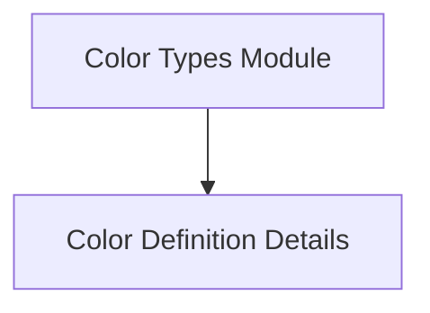

# Color Types Module

The `color_types` module in the Rich library defines the fundamental enumerations and classes for handling colors. It serves as the backbone for representing various color systems and specific color instances throughout the library, ensuring consistent color management and rendering.

## Architecture Overview

The `color_types` module is a crucial component within the `rich_color` module, specifically nested under `color_definition`. It encapsulates the core definitions of color types and individual color representations. The module's structure is straightforward, focusing on providing foundational color data structures that other Rich components utilize for rendering styled text and elements.

<!-- DIAGRAM_JSON
{
    "direction": "TD",
    "nodes": [
        {"id": "color_definition_details", "label": "Color Definition Details", "type": "module", "link": "color_definition_details.md"}
    ],
    "edges": [],
    "groups": []
}
-->

## Sub-modules

### Color Definition Details

This sub-module (`color_definition_details.md`) is responsible for defining the fundamental types of colors and representing specific color instances used throughout the Rich library. It contains:

*   `rich_color.ColorType`: An enumeration or class that specifies the different kinds of color systems or types (e.g., standard ANSI, 256-color, true color).
*   `rich_color.Color`: A class that encapsulates a specific color value, allowing for its creation, manipulation, and conversion across different color systems.

For more detailed information, refer to the [Color Definition Details](color_definition_details.md) documentation.