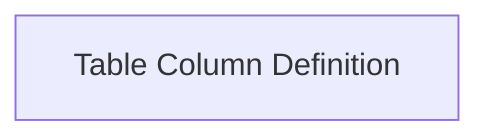

# Table Column Definition

Defines the properties and behavior of a table column.

## Components

This module contains 1 component(s):

- `Column`

## Structure

---
*This documentation was auto-generated to ensure completeness.*
