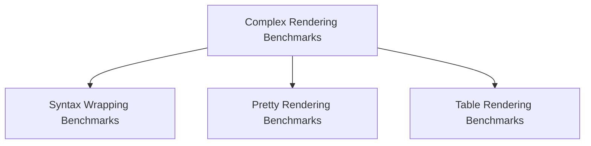

# Complex Rendering Benchmarks

## Introduction

The `complex_rendering_benchmarks` module is part of the larger `benchmarks` suite, designed to evaluate the performance of advanced rendering features within the system. It focuses on specific scenarios that involve more intricate rendering logic, such as syntax highlighting, pretty printing of complex data structures, and the rendering of rich tables.

This module helps identify performance bottlenecks and regressions in these critical rendering pathways, ensuring that the user experience remains smooth and responsive even with complex visual output.

## Architecture

The `complex_rendering_benchmarks` module is composed of several specialized benchmark suites, each targeting a distinct aspect of complex rendering. These sub-modules are designed to be independent but collectively contribute to a comprehensive performance profile of the rendering engine.

<!-- DIAGRAM_JSON
{
    "direction": "TD",
    "nodes": [
        {"id": "syntax_wrapping_benchmarks", "label": "Syntax Wrapping Benchmarks", "type": "module", "link": "syntax_wrapping_benchmarks.md"},
        {"id": "pretty_rendering_benchmarks", "label": "Pretty Rendering Benchmarks", "type": "module", "link": "pretty_rendering_benchmarks.md"},
        {"id": "table_rendering_benchmarks", "label": "Table Rendering Benchmarks", "type": "module", "link": "table_rendering_benchmarks.md"}
    ],
    "edges": [
        {"source": "complex_rendering_benchmarks_main", "target": "syntax_wrapping_benchmarks"},
        {"source": "complex_rendering_benchmarks_main", "target": "pretty_rendering_benchmarks"},
        {"source": "complex_rendering_benchmarks_main", "target": "table_rendering_benchmarks"}
    ],
    "groups": [
        {"id": "complex_rendering_benchmarks_main", "label": "complex_rendering_benchmarks", "nodes": ["syntax_wrapping_benchmarks", "pretty_rendering_benchmarks", "table_rendering_benchmarks"]}
    ]
}
-->

## Sub-modules Overview

*   ### [Syntax Wrapping Benchmarks](syntax_wrapping_benchmarks.md)
    This sub-module focuses on benchmarking the `SyntaxWrappingSuite` component. It measures the performance characteristics of wrapping and formatting code snippets, especially when syntax highlighting is involved. This is crucial for applications that display source code or structured text with rich visual styling.

*   ### [Pretty Rendering Benchmarks](pretty_rendering_benchmarks.md)
    This sub-module utilizes the `PrettySuite` component to benchmark the pretty-printing capabilities of the system. It evaluates how efficiently complex data structures, such as lists, dictionaries, and custom objects, are rendered into human-readable formats, considering indentation, line breaks, and object representation.

*   ### [Table Rendering Benchmarks](table_rendering_benchmarks.md)
    This sub-module benchmarks the `TableSuite` component, focusing on the performance of rendering tabular data. It assesses the efficiency of constructing and displaying tables, including aspects like column sizing, cell content rendering, and overall layout performance for various table complexities and sizes.

