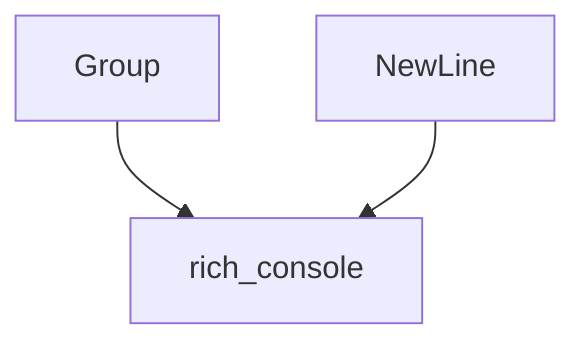

# composite_renderables Module Documentation

## Introduction

The `composite_renderables` module provides essential components for combining and structuring rich renderable objects within the [Rich](https://github.com/Textualize/rich) library. It specifically focuses on `Group`ing multiple renderables together and representing explicit `NewLine` characters to control console output layout. These components are fundamental for constructing complex and organized console displays.

## Core Functionality

This module encapsulates two key renderable components:

*   **`Group`**: Allows multiple [ConsoleRenderable](rich_console.md#consolerenderable) objects to be treated as a single unit. When a `Group` is rendered, its constituent renderables are rendered sequentially, facilitating the composition of complex layouts from simpler parts. This is particularly useful for logically grouping related output segments.

*   **`NewLine`**: A simple renderable that, when encountered by the [Console](rich_console.md#console), forces a new line in the output. This provides precise control over vertical spacing and ensures that subsequent renderables start on a fresh line, regardless of the current cursor position.

Together, these components empower developers to build sophisticated and well-structured console interfaces by offering fine-grained control over the arrangement and flow of rendered content.

## Architecture and Component Relationships

The `composite_renderables` module resides within the `renderable_elements` section of the `rich_console` module's hierarchy. Its components, `Group` and `NewLine`, are directly consumable by the [Console](rich_console.md#console) for rendering. They act as primitive building blocks that enable more complex renderable structures.

`Group` objects can contain any number of other [ConsoleRenderable](rich_console.md#consolerenderable) instances, including other `Group`s, forming a tree-like structure for renderable composition. `NewLine` provides a basic control primitive that influences the layout produced by the [Console](rich_console.md#console).

## How the Module Fits into the Overall System

The `composite_renderables` module plays a crucial role in the Rich library's rendering pipeline by providing mechanisms for content aggregation and layout control. It's a foundational piece for any Rich application that needs to display structured output.

By offering `Group`s, it enables the creation of reusable and modular renderable components, promoting cleaner code and more maintainable console applications. `NewLine` is vital for ensuring readability and correct formatting, preventing renderables from unintentionally merging on the same line. These capabilities are directly utilized by other higher-level Rich features, such as [Layout](rich_layout.md) and various panels or tables, to build their structured outputs.

<!-- DIAGRAM_JSON
{
    "direction": "TD",
    "nodes": [
        {"id": "group", "label": "Group", "type": "component", "link": null},
        {"id": "new_line", "label": "NewLine", "type": "component", "link": null},
        {"id": "rich_console", "label": "rich_console", "type": "external", "link": "rich_console.md"}
    ],
    "edges": [
        {"source": "group", "target": "rich_console"},
        {"source": "new_line", "target": "rich_console"}
    ],
    "groups": []
}
-->
