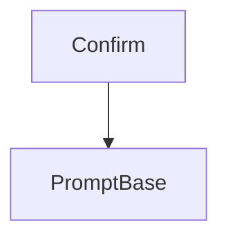

# `confirmation_prompts` Module Documentation

## Introduction

The `confirmation_prompts` module is a specialized component within the `rich_prompt` system, designed to handle binary (yes/no) user input. It provides the `Confirm` class, which simplifies the process of requesting confirmation from the user in command-line applications.

## Purpose and Core Functionality

This module's primary purpose is to offer a straightforward way to implement confirmation prompts. The `Confirm` class inherits from `PromptBase` (defined in the `prompt_base` module) and extends its functionality to specifically manage boolean inputs. When a `Confirm` prompt is presented to the user, it typically expects a "y" or "n" response (or similar locale-specific equivalents), guiding the user towards a clear yes/no decision.

## Architecture and Component Relationships

The `confirmation_prompts` module contains the `Confirm` class as its core internal component. It relies on the foundational capabilities provided by `rich_prompt.PromptBase` for its basic prompt handling, input processing, and rendering logic.

### Diagram

<!-- DIAGRAM_JSON
{
    "direction": "TD",
    "nodes": [
        {"id": "confirm", "label": "Confirm", "type": "component", "link": null},
        {"id": "prompt_base", "label": "PromptBase", "type": "external", "link": "prompt_base.md"}
    ],
    "edges": [
        {"source": "confirm", "target": "prompt_base"}
    ],
    "groups": []
}
-->

## How it Fits into the Overall System

The `confirmation_prompts` module is an integral part of the `rich_prompt` package, which provides a rich set of tools for interactive user input. It serves as a specific implementation for a common type of prompt, complementing other specialized prompts like `IntPrompt` and `FloatPrompt` (found in the `numerical_prompts` module). By abstracting the logic for confirmation prompts, it allows developers to easily integrate robust and user-friendly confirmation dialogues into their applications, enhancing the overall user experience and system reliability.
