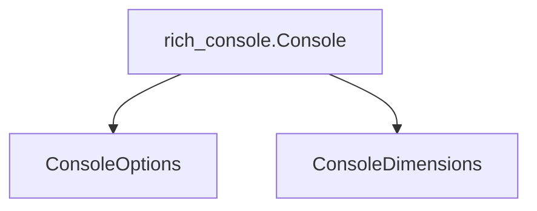

# `console_configuration`

## Introduction

The `console_configuration` module, part of the larger `rich_console` module, encapsulates the essential configuration settings and dimensional information for Rich's `Console` object. It provides mechanisms to define how the console behaves, including its width, height, and various rendering options, ensuring flexible and adaptable output across different environments.

## Architecture and Component Relationships

This module primarily focuses on two core components: `ConsoleOptions` and `ConsoleDimensions`. These components are crucial for tailoring the `Console`'s behavior and appearance. `ConsoleOptions` holds a collection of flags and settings that influence how content is rendered, while `ConsoleDimensions` provides the current width and height of the terminal or output area, allowing for responsive rendering.

These components are integral to the `rich_console.Console` class, which utilizes them to manage its rendering process and adapt to the environment.

<!-- DIAGRAM_JSON
{
    "direction": "TD",
    "nodes": [
        {"id": "console_options", "label": "ConsoleOptions", "type": "component", "link": null},
        {"id": "console_dimensions", "label": "ConsoleDimensions", "type": "component", "link": null},
        {"id": "rich_console", "label": "rich_console.Console", "type": "external", "link": "rich_console.md"}
    ],
    "edges": [
        {"source": "rich_console", "target": "console_options"},
        {"source": "rich_console", "target": "console_dimensions"}
    ],
    "groups": []
}
-->

## How the Module Fits into the Overall System

The `console_configuration` module provides the foundational settings and dimensional awareness for the `rich_console.Console` class, which is the central hub for all Rich rendering. By abstracting these configurations into dedicated components, the system achieves a clear separation of concerns, making the `Console` class more maintainable and its behavior more predictable. Any part of the Rich library that interacts with the console's rendering or requires information about the terminal's size will rely on the settings managed by this module. It ensures that Rich applications can dynamically adjust their output to various terminal sizes and user preferences, enhancing usability and aesthetics. Refer to the [rich_console](rich_console.md) documentation for more details on the core Console functionality.
