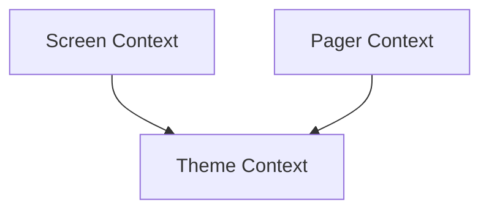

# Console Contexts Module

This module, `console_contexts`, is a crucial part of the `rich.console` ecosystem, specifically nested under `rendering_and_hooks`. It provides specialized context managers for various aspects of console rendering, ensuring consistent behavior and state management across different rendering operations.

## Architecture Overview

The `console_contexts` module is composed of three primary context managers, each responsible for a distinct aspect of console rendering:

<!-- DIAGRAM_JSON
{
    "direction": "TD",
    "nodes": [
        {"id": "screen_context", "label": "Screen Context", "type": "module", "link": "screen_context.md"},
        {"id": "pager_context", "label": "Pager Context", "type": "module", "link": "pager_context.md"},
        {"id": "theme_context", "label": "Theme Context", "type": "module", "link": "theme_context.md"}
    ],
    "edges": [
        {"source": "screen_context", "target": "theme_context"},
        {"source": "pager_context", "target": "theme_context"}
    ],
    "groups": []
}
-->

## Sub-modules and Core Functionality

### [Screen Context](screen_context.md)
Manages the screen context for Rich console rendering, handling screen-related rendering options.

### [Pager Context](pager_context.md)
Provides context for handling console paging, enabling multi-page output management.

### [Theme Context](theme_context.md)
Encapsulates the current theme settings for Rich console output, affecting styles and colors.
