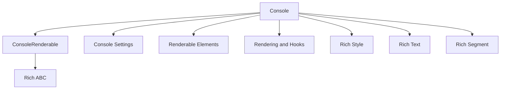

# Module: `console_core`

## Introduction
The `console_core` module is a foundational component of the Rich library, encapsulating the core mechanisms for rendering content to the terminal. It defines the primary `Console` class, which acts as the central orchestrator for all Rich output, and the `ConsoleRenderable` abstract base class, which all renderable Rich objects must implement. This module is critical for establishing consistent and styled output across various platforms.

## Comprehensive Documentation

### Purpose and Core Functionality
The `console_core` module serves two main purposes:
1.  **`Console` Class**: This is the most important class in the Rich library. It provides a high-level API for printing and rendering various Rich renderables, handling styling, layout, terminal capabilities, and more. It manages output streams, rich text styling, and the overall rendering process.
2.  **`ConsoleRenderable` Abstract Base Class**: This ABC defines the interface for any object that can be rendered by a `Console` instance. By implementing this interface, any custom object can be seamlessly integrated into Rich's rendering pipeline, allowing `Console` to present it correctly.

Together, these components form the backbone of Rich's rendering capabilities, enabling complex, beautiful, and interactive terminal interfaces.

### Architecture and Component Relationships

The `console_core` module sits within the `rich_console` hierarchy, specifically under `console_interaction`. It leverages several other modules to achieve its functionality:

*   **`rich_console.console_settings`**: The `Console` class relies on `ConsoleOptions` to determine how content should be rendered (e.g., width, height, color system) and uses `ConsoleDimensions` to understand the terminal's size. `ConsoleThreadLocals` manages thread-specific console state.
*   **`rich_console.renderable_elements`**: `Console` is responsible for rendering common elements like `Group` (for combining multiple renderables), `NewLine` (for explicit line breaks), and `Capture` (for capturing console output).
*   **`rich_console.rendering_and_hooks`**: The `Console` class integrates with `RenderHook` for custom rendering logic, and interacts with various context managers like `ScreenContext`, `PagerContext`, and `ThemeContext` (from `console_contexts.md`) to manage the rendering environment.
*   **`rich_abc`**: The `ConsoleRenderable` likely inherits from `rich_abc.RichRenderable`, defining a common interface for all renderable objects in Rich.
*   **`rich_style`, `rich_text`, `rich_segment`**: These modules provide the fundamental building blocks for styled text and low-level console output, which `Console` orchestrates during the rendering process. `Console` converts high-level renderables into a sequence of `Segment` objects for efficient terminal display.

### How the Module Fits into the Overall System

The `console_core` module is the central hub for all rendering operations in Rich. Almost every other Rich component, from `rich_panel.Panel` to `rich_table.Table` and `rich_progress.Progress`, is designed to be rendered by a `Console` instance. It provides the crucial interface for developers to interact with the terminal and display Rich's extensive range of styled output.

It acts as the intermediary between high-level renderable objects and the low-level terminal output, handling details like ANSI escape codes, color translation, and buffering. Without `console_core`, the Rich library would not be able to display any styled content to the user.

<!-- DIAGRAM_JSON
{
    "direction": "TD",
    "nodes": [
        {"id": "Console", "label": "Console", "type": "component", "link": null},
        {"id": "ConsoleRenderable", "label": "ConsoleRenderable", "type": "component", "link": null},
        {"id": "console_settings", "label": "Console Settings", "type": "external", "link": "console_settings.md"},
        {"id": "renderable_elements", "label": "Renderable Elements", "type": "external", "link": "renderable_elements.md"},
        {"id": "rendering_and_hooks", "label": "Rendering and Hooks", "type": "external", "link": "rendering_and_hooks.md"},
        {"id": "rich_abc", "label": "Rich ABC", "type": "external", "link": "rich_abc.md"},
        {"id": "rich_style", "label": "Rich Style", "type": "external", "link": "rich_style.md"},
        {"id": "rich_text", "label": "Rich Text", "type": "external", "link": "rich_text.md"},
        {"id": "rich_segment", "label": "Rich Segment", "type": "external", "link": "rich_segment.md"}
    ],
    "edges": [
        {"source": "Console", "target": "ConsoleRenderable"},
        {"source": "Console", "target": "console_settings"},
        {"source": "Console", "target": "renderable_elements"},
        {"source": "Console", "target": "rendering_and_hooks"},
        {"source": "ConsoleRenderable", "target": "rich_abc"},
        {"source": "Console", "target": "rich_style"},
        {"source": "Console", "target": "rich_text"},
        {"source": "Console", "target": "rich_segment"}
    ],
    "groups": []
}
-->

