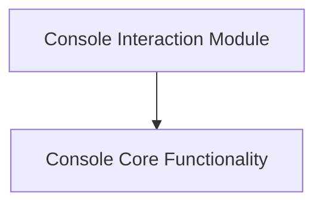

# Console Interaction Module

The `console_interaction` module is a fundamental part of the `rich` library, providing the core components necessary for rendering rich content to the terminal. It primarily exposes the `Console` class, which serves as the central object for all output operations, and the `ConsoleRenderable` interface, which defines how objects can be displayed.

## Architecture Overview

The `console_interaction` module, while focused on its core components, integrates with other parts of the `rich.console` ecosystem. It relies on the broader `core_console_components` for managing console settings and various renderable elements. The `console_core` sub-module encapsulates the primary interaction points.

<!-- DIAGRAM_JSON
{
    "direction": "TD",
    "nodes": [
        {"id": "console_core", "label": "Console Core Functionality", "type": "module", "link": "console_core.md"}
    ],
    "edges": [
        
    ],
    "groups": []
}
-->

## High-Level Functionality

*   **Console Core Functionality (`console_core.md`):** This sub-module defines the `Console` object, the primary interface for rendering rich content, and `ConsoleRenderable`, an abstract base class for objects that can be rendered by the console. Together, they form the backbone of `rich`'s rendering capabilities.
