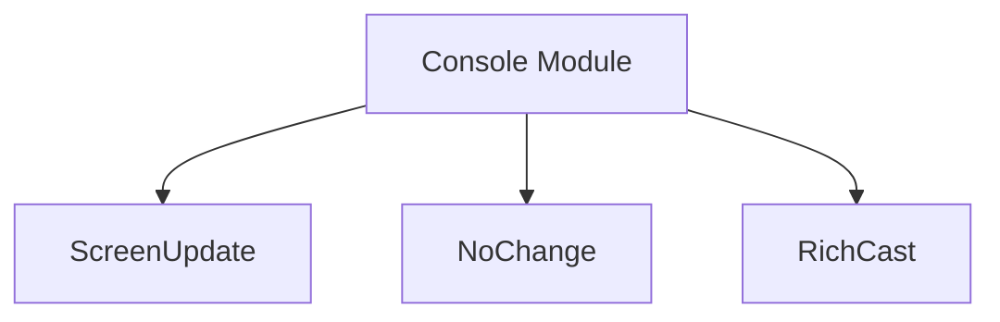

# `console_rendering_utilities` Module

## Introduction
The `console_rendering_utilities` module provides essential components for managing rendering updates and type casting within the Rich console system. It acts as a foundational layer for efficient and flexible content display, ensuring smooth and optimized output.

## Module Documentation
This module is a sub-module of `rich_console.rendering_and_hooks.rendering_utilities` and encapsulates core classes that facilitate the dynamic updating and preparation of content for rendering. It plays a crucial role in the lifecycle of content displayed by the Rich library, ensuring that only necessary updates occur and that various data types can be seamlessly integrated into the console output.

### Core Components

*   **`ScreenUpdate`**
    This component (`rich_console.ScreenUpdate`) is a signal or object indicating that a change has occurred in the renderable content and the console display needs to be refreshed. It's used internally by the Rich console to trigger re-rendering processes, ensuring the user sees the most current state of the application.

*   **`NoChange`**
    Conversely, `rich_console.NoChange` signifies that the renderable content has not changed since the last update. This is vital for performance optimization, preventing unnecessary re-renders when the displayed information remains static. It allows the Rich console to efficiently skip rendering cycles, conserving resources.

*   **`RichCast`**
    The `rich_console.RichCast` component is likely an abstract base class or an interface that defines how objects can be "cast" or converted into a format that the Rich console can render. It enables various external objects and data types to be seamlessly integrated into Rich's rendering pipeline, providing flexibility in what can be displayed.

### Relationship to `rich_console`
This module is tightly integrated with the [rich_console](rich_console.md) module, specifically within its rendering utilities. The `rich_console.Console` object relies on these utilities to manage its output stream, decide when to update the screen, and correctly interpret various data types for display. Developers interacting with the `Console` instance implicitly leverage these utilities for a smooth and efficient rendering experience.

### Module Integration
As a leaf module, `console_rendering_utilities` provides fundamental building blocks consumed by higher-level components within the `rich_console` ecosystem. It directly contributes to the overall efficiency and flexibility of Rich's rendering capabilities by handling the intricacies of screen updates and object casting.

## Architecture Diagram

<!-- DIAGRAM_JSON
{
    "direction": "TD",
    "nodes": [
        {"id": "screen_update", "label": "ScreenUpdate", "type": "component", "link": null},
        {"id": "no_change", "label": "NoChange", "type": "component", "link": null},
        {"id": "rich_cast", "label": "RichCast", "type": "component", "link": null},
        {"id": "rich_console_module", "label": "Console Module", "type": "external", "link": "rich_console.md"}
    ],
    "edges": [
        {"source": "rich_console_module", "target": "screen_update"},
        {"source": "rich_console_module", "target": "no_change"},
        {"source": "rich_console_module", "target": "rich_cast"}
    ],
    "groups": []
}
-->

