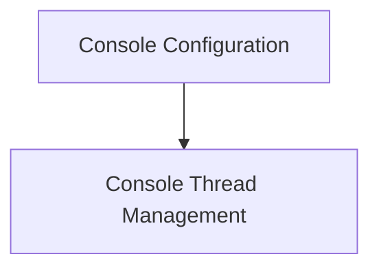

# Console Settings Module

## Introduction

The `console_settings` module in Rich provides essential components for configuring and managing the operational behavior and dimensions of the console. It encapsulates settings that dictate how Rich renders content, handles screen real estate, and manages thread-specific console states, ensuring consistent and controlled output.

## Architecture

The `console_settings` module comprises components that define console options, dimensions, and thread-local storage. These components work together to provide a robust framework for customizing console behavior.

<!-- DIAGRAM_JSON
{
    "direction": "TD",
    "nodes": [
        {"id": "console_configuration", "label": "Console Configuration", "type": "module", "link": "console_configuration.md"},
        {"id": "console_thread_management", "label": "Console Thread Management", "type": "module", "link": "console_thread_management.md"}
    ],
    "edges": [
        {"source": "console_configuration", "target": "console_thread_management"}
    ],
    "groups": []
}
-->

## Sub-modules

### Console Configuration ([console_configuration.md](console_configuration.md))
This sub-module focuses on defining the various options and dimensions that govern the console's rendering behavior. It includes `ConsoleOptions` for controlling aspects like terminal width, height, and color depth, and `ConsoleDimensions` for representing the current size of the console viewport.

### Console Thread Management ([console_thread_management.md](console_thread_management.md))
This sub-module handles thread-local storage pertinent to the console. The `ConsoleThreadLocals` component ensures that each thread interacting with Rich can maintain its own specific console context, which is crucial for multi-threaded applications to avoid conflicts and maintain proper state.