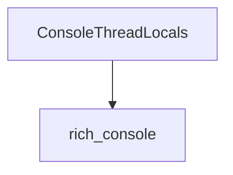

# Console Thread Management (console_thread_management)

## Introduction

The `console_thread_management` module is a vital component within the Rich library, responsible for managing thread-local data pertinent to the console's operation. It ensures that console-related settings and states are properly isolated and accessible within their respective threads, preventing conflicts and maintaining consistency in multi-threaded applications.

## Architecture and Component Relationships

This module primarily exposes `ConsoleThreadLocals`, a core component that leverages Python's `threading.local()` to store data unique to each thread. This is crucial for applications where multiple threads might be interacting with a Rich console instance simultaneously, allowing each thread to maintain its own context without interfering with others.

It is a sub-module of `console_settings`, which itself is part of the `core_console_components` under the main `rich_console` module. This hierarchical structure indicates its role in providing foundational threading support for the broader console functionality.

<!-- DIAGRAM_JSON
{
    "direction": "TD",
    "nodes": [
        {"id": "console_thread_locals", "label": "ConsoleThreadLocals", "type": "component", "link": null},
        {"id": "rich_console", "label": "rich_console", "type": "external", "link": "rich_console.md"}
    ],
    "edges": [
        {"source": "console_thread_locals", "target": "rich_console"}
    ],
    "groups": []
}
-->

## How the Module Fits into the Overall System

The `console_thread_management` module, through `ConsoleThreadLocals`, plays a critical role in enabling thread-safe console operations. It ensures that variables and settings that should be unique to a particular thread (e.g., console output buffers, styling contexts, or render states) are correctly managed.

This is essential for the `rich_console` module, particularly when Rich is used in complex applications that employ threading for tasks like background processing, concurrent I/O, or parallel rendering. By isolating thread-specific data, `console_thread_management` helps maintain the integrity and predictability of console output, preventing race conditions and ensuring that each thread's interaction with the console is independent and correct. It underpins the robustness of the Rich library in multi-threaded environments, making it a foundational piece for reliable and consistent console rendering.