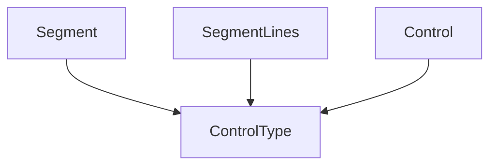

The `control_type_definition` module is a fundamental component within the Rich library, specifically responsible for defining the `ControlType` enumeration. This enumeration standardizes the various control codes and instructions that can be embedded within text segments, enabling Rich to perform intricate rendering operations, such as cursor movements, style applications, and other terminal manipulations.

### Purpose and Core Functionality

The primary purpose of `control_type_definition` is to encapsulate the different types of control sequences used by Rich. The `ControlType` defines a set of distinct, well-defined control instructions that can be associated with `Segment` objects. By centralizing these definitions, the module ensures consistency and simplifies the interpretation and application of control codes throughout the Rich rendering pipeline. This allows for precise control over how text is displayed, styled, and positioned within the terminal.

### Architecture and Component Relationships

The `control_type_definition` module contains the `ControlType` component, which serves as a common reference for various rendering components.

*   **`ControlType`**: This component enumerates the different types of control instructions. Examples might include instructions for changing foreground/background colors, applying styles (bold, italic), moving the cursor, or other terminal-specific commands.

This module plays a crucial role in the broader `rich_segment` module, where `Segment` and `SegmentLines` components utilize `ControlType` to construct and process renderable text units that include embedded control instructions. It is also conceptually linked to the `rich_control` module's `Control` component, which likely represents an instance of a control instruction that would reference these `ControlType` definitions.

<!-- DIAGRAM_JSON
{
    "direction": "TD",
    "nodes": [
        {"id": "control_type_definition_control_type", "label": "ControlType", "type": "component", "link": null},
        {"id": "segment", "label": "Segment", "type": "external", "link": "rich_segment.md"},
        {"id": "segment_lines", "label": "SegmentLines", "type": "external", "link": "rich_segment.md"},
        {"id": "control", "label": "Control", "type": "external", "link": "rich_control.md"}
    ],
    "edges": [
        {"source": "segment", "target": "control_type_definition_control_type"},
        {"source": "segment_lines", "target": "control_type_definition_control_type"},
        {"source": "control", "target": "control_type_definition_control_type"}
    ],
    "groups": []
}
-->

### How the Module Fits into the Overall System

The `control_type_definition` module is a foundational layer for Rich's advanced text rendering capabilities. By providing a standardized way to define and categorize control codes, it enables other modules, such as `rich_segment` and `rich_console`, to interpret and apply these instructions correctly. This ensures that Rich can accurately render complex styled text, progress bars, tables, and other rich content by precisely controlling terminal output, making it a critical part of the library's ability to produce visually rich and interactive console applications.
