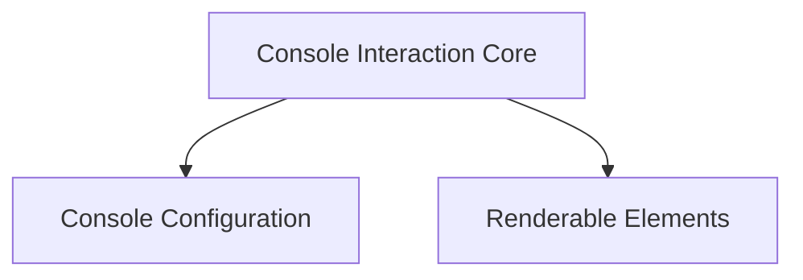

# Core Console Components

The `core_console_components` module provides the fundamental building blocks for Rich's console rendering and interaction. It encapsulates the core `Console` object, defines how renderable objects are handled, and manages console-specific settings and thread-local state.

## Architecture Overview

The module is structured into several key sub-modules, each responsible for a distinct aspect of console functionality. These components work together to provide a robust and flexible system for rendering rich content to the terminal.

<!-- DIAGRAM_JSON
{
    "direction": "TD",
    "nodes": [
        {"id": "console_interaction", "label": "Console Interaction Core", "type": "module", "link": "console_interaction.md"},
        {"id": "console_settings", "label": "Console Configuration", "type": "module", "link": "console_settings.md"},
        {"id": "renderable_elements", "label": "Renderable Elements", "type": "module", "link": "renderable_elements.md"}
    ],
    "edges": [
        {"source": "console_interaction", "target": "console_settings"},
        {"source": "console_interaction", "target": "renderable_elements"}
    ],
    "groups": []
}
-->

## Sub-modules

### [Console Interaction Core](console_interaction.md)
This sub-module contains the primary `Console` class, which is the central object for all rendering operations, and `ConsoleRenderable`, an interface for objects that can be rendered by the console. It manages the output to the terminal, styling, and various rendering options.

### [Console Configuration](console_settings.md)
This sub-module is responsible for managing the various settings and environmental aspects of the console. It includes `ConsoleOptions` for controlling rendering behavior, `ConsoleDimensions` for screen size, and `ConsoleThreadLocals` for handling thread-specific console state.

### [Renderable Elements](renderable_elements.md)
This sub-module defines fundamental elements that can be rendered by the console. It includes `Group` for combining multiple renderables, `NewLine` for explicit line breaks, and `Capture` for capturing console output to a string.