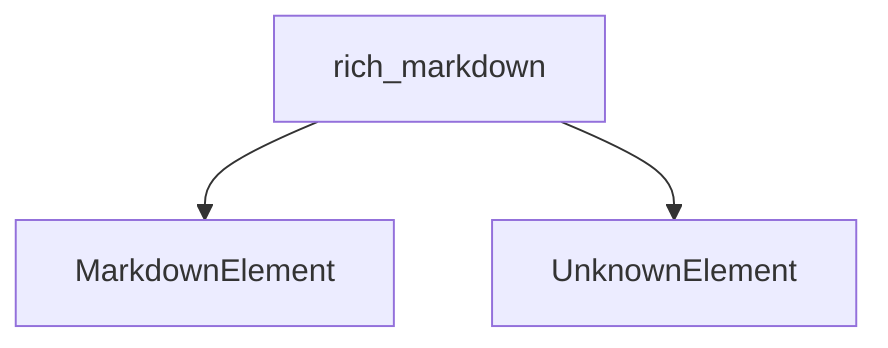

# `core_markdown_blocks` Module Documentation

## Introduction

The `core_markdown_blocks` module serves as the foundational layer for representing the most basic structural elements within Rich's Markdown rendering system. It defines the abstract base for all Markdown elements and a specific element for handling unrecognized or unsupported Markdown constructs. This module is a leaf node within the `rich_markdown.markdown_elements.basic_markdown_blocks` hierarchy, providing the fundamental building blocks upon which more complex Markdown structures are built.

## Architecture and Component Relationships

This module encapsulates the core abstract concept of a Markdown element and a concrete representation for unknown elements. It relies heavily on the broader `rich_markdown` module for context, parsing, and rendering logic.

<!-- DIAGRAM_JSON
{
    "direction": "TD",
    "nodes": [
        {"id": "markdown_element", "label": "MarkdownElement", "type": "component", "link": null},
        {"id": "unknown_element", "label": "UnknownElement", "type": "component", "link": null},
        {"id": "rich_markdown", "label": "rich_markdown", "type": "external", "link": "rich_markdown.md"}
    ],
    "edges": [
        {"source": "rich_markdown", "target": "markdown_element"},
        {"source": "rich_markdown", "target": "unknown_element"}
    ],
    "groups": []
}
-->

### Core Components

#### `MarkdownElement`

`MarkdownElement` is an abstract base class that all other specific Markdown elements (e.g., Paragraph, Heading, Link) inherit from within the `rich_markdown` system. It provides a common interface and potentially shared properties for any construct recognized as a Markdown component. This ensures consistency and allows for polymorphic handling of various Markdown types during parsing and rendering.

#### `UnknownElement`

The `UnknownElement` class is a concrete implementation of `MarkdownElement` designed to represent any part of the Markdown input that the parser cannot recognize or does not support. This component is crucial for robust parsing, as it allows the system to gracefully handle malformed or custom Markdown syntax without crashing. Instead, it encapsulates the unrecognized segment, allowing for potential logging, error reporting, or simply rendering it as raw text.

## How the Module Fits into the Overall System

The `core_markdown_blocks` module provides the most fundamental abstractions for the [rich_markdown](rich_markdown.md) module. `MarkdownElement` establishes the contract for all renderable Markdown nodes, while `UnknownElement` handles exceptions during parsing. These components are essential for the initial stages of Markdown processing, where the raw text is tokenized and transformed into a tree of `MarkdownElement` objects. Subsequent modules then process and render this tree into Rich's console output. Without these core definitions, the entire Markdown parsing and rendering pipeline would lack a consistent base for its structural elements.