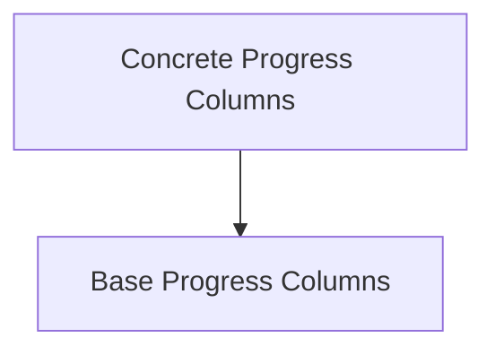

# display_columns Module Documentation

## Introduction

The `display_columns` module is a crucial component within the `rich.progress` library, specifically designed to manage and render various types of columns displayed in a progress bar. It provides a flexible framework for visualizing progress, offering both abstract base classes for custom column creation and a rich set of concrete implementations for common display needs such as transfer speeds, spinners, progress bars, and descriptive text.

This module plays a vital role in enhancing the user experience by presenting real-time updates in a clear and customizable format, making it easier to track long-running operations.

## Architecture Overview

The `display_columns` module is structured into two main sub-modules:

*   **Base Progress Columns**: Defines the fundamental interfaces and abstract classes that all progress columns must adhere to.
*   **Concrete Progress Columns**: Implements various specific column types that can be directly used in progress displays.

These sub-modules work together to provide a robust and extensible system for progress visualization.

<!-- DIAGRAM_JSON
{
    "direction": "TD",
    "nodes": [
        {"id": "base_progress_columns", "label": "Base Progress Columns", "type": "module", "link": "base_progress_columns.md"},
        {"id": "concrete_progress_columns", "label": "Concrete Progress Columns", "type": "module", "link": "concrete_progress_columns.md"}
    ],
    "edges": [
        {"source": "concrete_progress_columns", "target": "base_progress_columns"}
    ],
    "groups": []
}
-->

## Sub-modules

### [Base Progress Columns](base_progress_columns.md)

This sub-module (`base_progress_columns`) defines the foundational components for creating progress columns. It includes `ProgressColumn` and `RenderableColumn`, which serve as abstract interfaces and base classes, establishing the contract for how progress columns should behave and render. Developers can extend these classes to create highly customized display elements for their progress bars.

### [Concrete Progress Columns](concrete_progress_columns.md)

Building upon the base classes, the `concrete_progress_columns` sub-module provides a suite of ready-to-use column implementations. This includes `TransferSpeedColumn` for displaying data transfer rates, `SpinnerColumn` for indicating activity, `BarColumn` for visual progress representation, `TaskProgressColumn` for specific task progress, and `TextColumn` for displaying arbitrary text. These components offer immediate utility for diverse progress visualization scenarios.