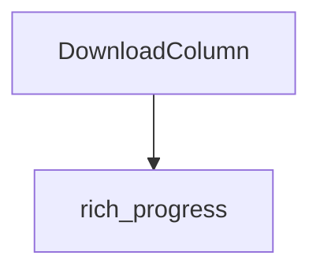

# download_progress Module Documentation

## Introduction

The `download_progress` module, a sub-module within `rich_progress.progress_columns.file_metrics_columns`, provides the `DownloadColumn` component. This component is specifically designed to display the progress of downloads in a human-readable format within Rich's progress bars. It integrates seamlessly with the `rich_progress` module to offer a dynamic and informative visual representation of ongoing file transfers.

## Architecture and Component Relationships

The `download_progress` module primarily consists of the `DownloadColumn` class. This class extends the `ProgressColumn` base class from the `rich_progress` module, inheriting its core functionality for rendering progress information. `DownloadColumn` focuses on calculating and displaying the downloaded amount, often in conjunction with `TotalFileSizeColumn` or `FileSizeColumn` to provide a complete picture of the transfer progress.

<!-- DIAGRAM_JSON
{
    "direction": "TD",
    "nodes": [
        {"id": "DownloadColumn", "label": "DownloadColumn", "type": "component", "link": null},
        {"id": "rich_progress", "label": "rich_progress", "type": "external", "link": "rich_progress.md"}
    ],
    "edges": [
        {"source": "DownloadColumn", "target": "rich_progress"}
    ],
    "groups": []
}
-->

## How the Module Fits into the Overall System

The `download_progress` module is a specialized component of the `rich_progress` system. It provides a crucial column type for users who need to visualize file download progress. By abstracting the logic for displaying downloaded bytes, it allows developers to easily incorporate professional-looking download indicators into their applications without extensive custom code. It works in concert with other progress columns like `TransferSpeedColumn` and `TimeRemainingColumn` to create comprehensive progress displays for file transfer operations.

For more details on the core progress functionality, refer to the [rich_progress module documentation](rich_progress.md).
