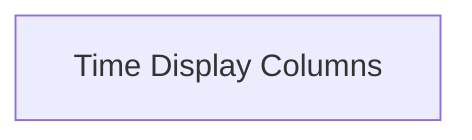

# `duration_columns` Module Documentation

## Introduction

The `duration_columns` module provides specialized columns for displaying time-related information within `rich` progress bars. It includes components for showing the estimated time remaining and the elapsed time for tasks.

## Architecture Overview

This module is a part of the `rich.progress` module, specifically within the `progress_columns` sub-module. It focuses on rendering time-based progress information.

<!-- DIAGRAM_JSON
{
    "direction": "TD",
    "nodes": [
        {"id": "time_display_columns", "label": "Time Display Columns", "type": "module", "link": "time_display_columns.md"}
    ],
    "edges": [],
    "groups": []
}
-->

## Sub-modules

### `time_display_columns`

The `time_display_columns` sub-module encapsulates the core functionality for rendering time remaining and elapsed time within progress bars. It provides the `TimeRemainingColumn` and `TimeElapsedColumn` components, which are essential for giving users a clear indication of task progress.

For more detailed information, refer to the [Time Display Columns Documentation](time_display_columns.md).