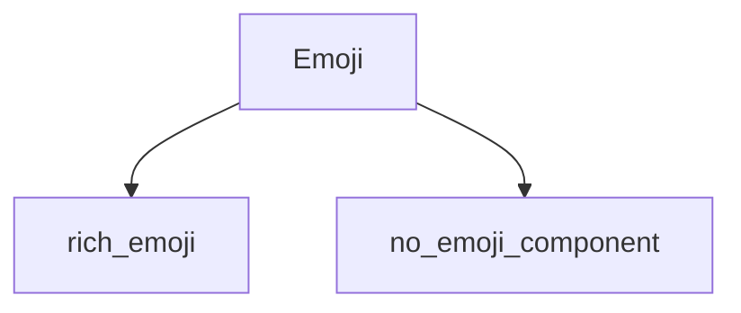

The `emoji_component` module provides the core implementation for handling and rendering emoji characters within the Rich library. It encapsulates the logic required to display emojis correctly across different terminals and environments, ensuring consistent visual representation.

## Architecture and Component Relationships

The `emoji_component` module is a specialized part of the `rich_emoji` family, specifically focusing on the `Emoji` class. It works in conjunction with its sibling module, `no_emoji_component`, which handles scenarios where emojis are not supported or are explicitly disabled. This module integrates with the broader `rich_emoji` module, which likely defines the overarching strategy for emoji management.

<!-- DIAGRAM_JSON
{
    "direction": "TD",
    "nodes": [
        {"id": "emoji_component_emoji", "label": "Emoji", "type": "component", "link": null},
        {"id": "rich_emoji", "label": "rich_emoji", "type": "external", "link": "rich_emoji.md"},
        {"id": "no_emoji_component", "label": "no_emoji_component", "type": "external", "link": "no_emoji_component.md"}
    ],
    "edges": [
        {"source": "emoji_component_emoji", "target": "rich_emoji"},
        {"source": "emoji_component_emoji", "target": "no_emoji_component"}
    ],
    "groups": []
}
-->

## Core Functionality

The `emoji_component` module, through its `Emoji` core component, is responsible for:

*   **Emoji Representation**: Storing and managing the textual representation of an emoji.
*   **Width Calculation**: Determining the correct display width of an emoji character, which can vary from standard single-character width, crucial for proper alignment in console output.
*   **Integration**: Providing the necessary interface for other Rich components (like `rich_console`, `rich_text`, or `rich_table`) to render emojis as part of a larger output stream.

## Module Integration

This module is a leaf component within the `rich_emoji` hierarchy. It depends on the foundational definitions and strategies provided by the main `rich_emoji` module. It also works in contrast or conjunction with `no_emoji_component`, which handles the absence of emoji rendering. This separation of concerns allows for flexible emoji handling based on user preferences or terminal capabilities.