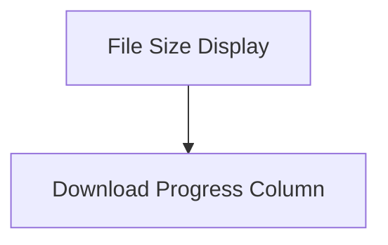

# File Metrics Columns Module

## Introduction

The `file_metrics_columns` module provides specialized column renderables for Rich progress bars, focusing on displaying file-related metrics such as file sizes and download progress. These columns are essential for providing users with real-time feedback on file operations within rich progress displays.

## Architecture Overview

This module integrates with the larger `rich.progress` system, specifically within the `progress_columns` sub-module. It defines distinct column types for presenting file size information and download status. The architecture is straightforward, with each component serving a specific display purpose within a progress bar's layout.

<!-- DIAGRAM_JSON
{
    "direction": "TD",
    "nodes": [
        {"id": "file_size_display", "label": "File Size Display", "type": "module", "link": "file_size_display.md"},
        {"id": "download_progress", "label": "Download Progress Column", "type": "module", "link": "download_progress.md"}
    ],
    "edges": [
        {"source": "file_size_display", "target": "download_progress", "label": "related to"}
    ],
    "groups": []
}
-->

## Sub-modules

### [File Size Display](file_size_display.md)
This sub-module contains columns responsible for displaying file sizes, both for individual files and aggregated total file sizes within a progress context.

### [Download Progress Column](download_progress.md)
This sub-module provides a column specifically designed to visualize the progress of a download operation within a Rich progress bar.