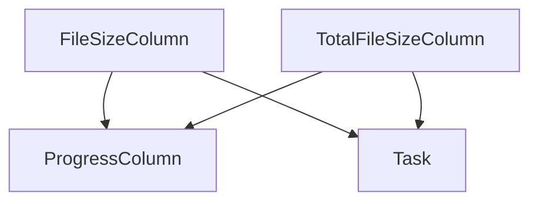

# file_size_display Module Documentation

## Introduction

The `file_size_display` module, a sub-module of `rich.progress`, provides specialized `ProgressColumn` implementations for displaying file sizes in a human-readable format during progress tracking. It includes components for showing the size of individual files (`FileSizeColumn`) and the total size of all files (`TotalFileSizeColumn`).

## Purpose and Core Functionality

The primary purpose of this module is to enhance the user experience of progress bars by offering clear and concise file size information. This is particularly useful for operations involving file transfers, downloads, or any process where tracking data volume is important.

### Core Components:

*   `FileSizeColumn`: Displays the size of the current file being processed for a given progress task.
*   `TotalFileSizeColumn`: Displays the cumulative total size of all files associated with a progress task.

These columns automatically format byte counts into appropriate units (e.g., KB, MB, GB) for readability.

## Architecture and Component Relationships

The `file_size_display` module's components are designed to integrate seamlessly with the `rich.progress.Progress` system. Both `FileSizeColumn` and `TotalFileSizeColumn` inherit from `ProgressColumn`, allowing them to be easily added to any `Progress` instance.

<!-- DIAGRAM_JSON
{
    "direction": "TD",
    "nodes": [
        {"id": "file_size_column", "label": "FileSizeColumn", "type": "component", "link": null},
        {"id": "total_file_size_column", "label": "TotalFileSizeColumn", "type": "component", "link": null},
        {"id": "progress_column", "label": "ProgressColumn", "type": "external", "link": "rich_progress.md"},
        {"id": "task", "label": "Task", "type": "external", "link": "rich_progress.md"}
    ],
    "edges": [
        {"source": "file_size_column", "target": "progress_column"},
        {"source": "total_file_size_column", "target": "progress_column"},
        {"source": "file_size_column", "target": "task"},
        {"source": "total_file_size_column", "target": "task"}
    ],
    "groups": []
}
-->

## How the Module Fits into the Overall System

The `file_size_display` module is a crucial part of the rich library's comprehensive progress display capabilities. It extends the core [rich_progress.md](rich_progress.md) module by providing specific columns for file size visualization. Developers can include `FileSizeColumn` and `TotalFileSizeColumn` in their `rich.progress.Progress` instances to give users immediate feedback on data volume during long-running file operations. This module enhances the clarity and utility of progress bars, making it easier to track the status of file-related tasks.

For more general information on progress bars and their customization, refer to the [rich_progress.md](rich_progress.md) documentation.